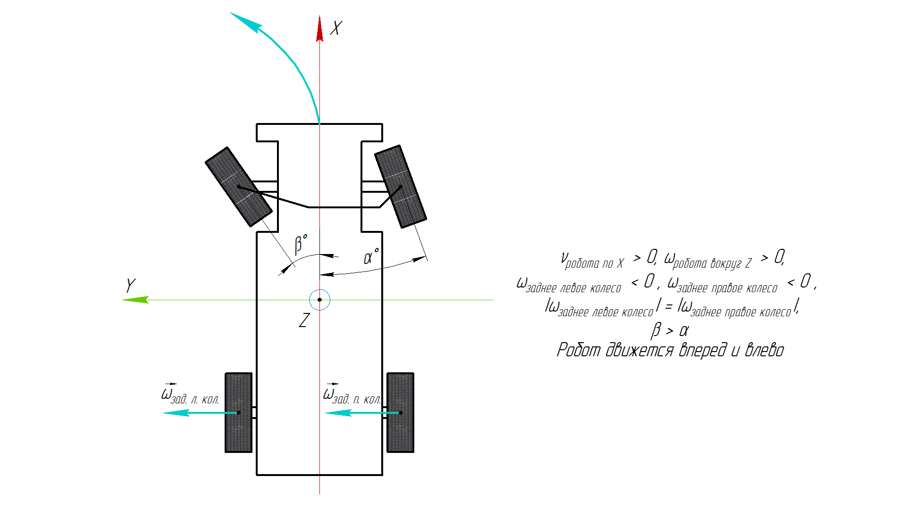
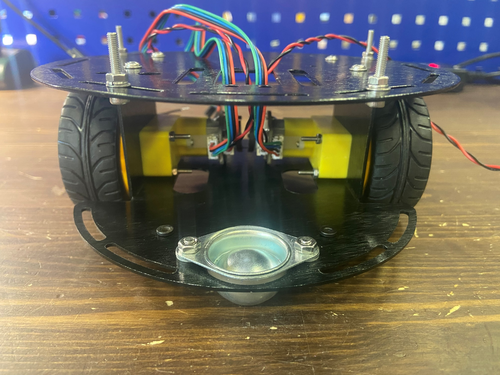
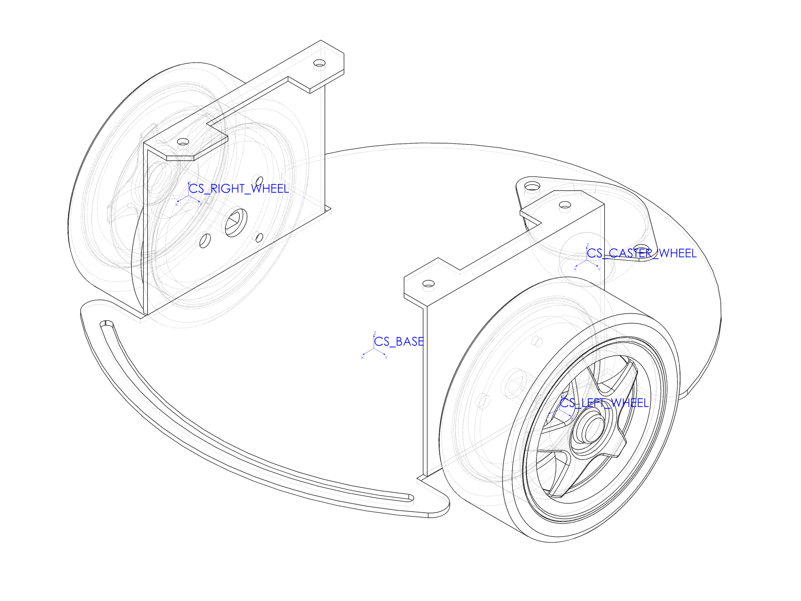
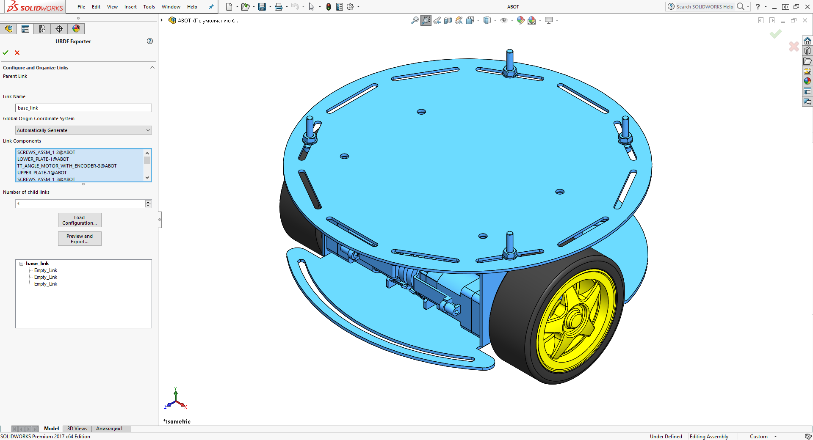
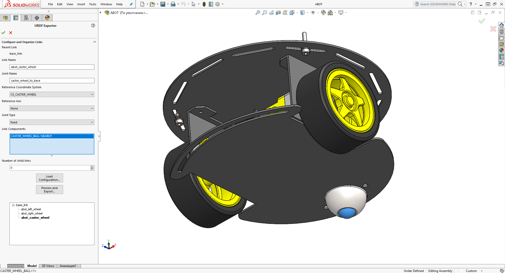
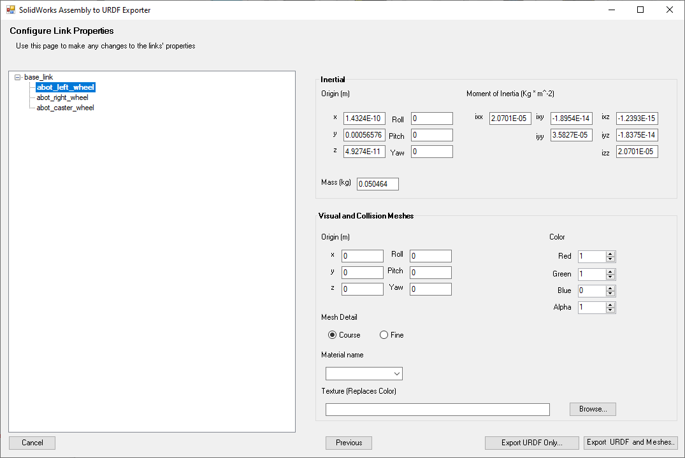
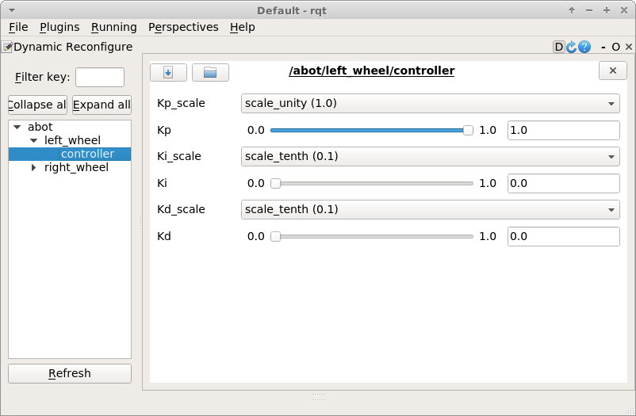

## Введение

Привет!

В этой статье мы на примере расскажем о том как создать настоящего робота работающего на ROS. Это будет наш первый простой робот со своей операционной системой.

Далее мы постараемся пошагово и как можно подробней рассказать вам о процессе проектирования, конструирования и программирования робота а так же расскажем с каким трудностями и проблемами мы столкнулись.

Создание свеого робота это не сложная но и нетривиальная задача. Данная задача требует определенных хотя бы минимальных следующих навыков:

- Работа с OS Linux
- 3Д твердотельное моделирование
- Программирование на С++ или Python
- Навыки 3Д печати

Так же понадобится персональный компьютер под управлением OS Linux и OS Windows и локальная Wi-Fi сеть.

Все исходники как конструкторские САПР файлы так и исходный код мы разместили в Github репозитории [https://github.com/gabbapeople/abot](https://github.com/gabbapeople/abot).

## Цель робота

Постройка робота начинается с идеи. Прежде чем лететь собирать робота вам нужно ответить для себя на следующие вопросы:

- Как должен выглядеть мой робот?
- Из каких частей/сегментов мой робот будет состоять?
- Что мой робот должен делать и как?

Все настоящие роботы создаются с какой либо целью. Человек стремится облегчить себе жизнь переложив часть своих задач на робота. Робот может выполнять тяжелую физическую работу, например сварочные роботы манипуляторы или транспортные роботы на автоматизированных складах-хранилищах. Или же робот может выполнять потенциально опасные для человека работы, например разминирование или работа в завалах или токсичных, ядовитых средах. Так же робот может избавить человека от рутинных задач для экономия времени - робот пылесос, автономный транспорт.

Цель создания робота практически полностью определяет его внешний вид, конструкцию и программу. Обычно робот созданный для работы в одной области не способен работать в какой либо другой. Цель создания нашего робота будет скорее обучающей и развлекательной нежели практической.

Мы попробуем создать робота "офисного питомца". Этакий робот который будет жить с нами в офисе и передвигаться туда куда мы ему скажем при этом робот должен будет самостоятельно ориентироваться в помещении. Кажется что навигация в помещении это легкая задача однако это совсем не так. В дальнейшем мы будем добавлять функционал нашему роботу но начнем именно с этой конкретной задачи.

Итак раз мы решили что робот не стационарный а мобильный то он должен каким то образом передвигаться.

## Привод робота

### Типы приводов

Рассмотрим разные типы приводов мобильных роботов, выясним какую механику эти привода используют, выделим их плюсы и минусы. Затем выберем привод для нашего робота.

Роботы могут передвигаться в 2D или 3D пространстве. Очевидно, роботы способные двигаться в трехмерном пространстве - летающие. Это чрезвычано сложные роботы, например летающие дроны способные ориентироваться в помещении или на местности используя трехмерные камеры глубины. Постойка такого робота требует сложнейшего железа и программного обеспечения поэтому летающего робота мы не рассматриваем.

Если робот передвигается только в двухмерном пространстве то все становится уже проще. Мы можем рассмотреть движение робота как движение материальной точки в плоскости (X, Y) в [прямоугольной или Декартовой системе координат](https://ru.wikipedia.org/wiki/Прямоугольная_система_координат) (X, Y, Z).

В этой плоскости движение робота может быть [голономным](https://ru.wikipedia.org/wiki/Голономная_система) (Holonomic) или [неголономным](https://ru.wikipedia.org/wiki/Неголономная_система) (Non-holonomic). Что это значит? При голономном движении, движение робота не имеет каких либо ограничений и он способен двигаться по любому верктору XY не меняя при этом своей ориентации. При неголономном движении, движение робота ограничено и он может передвигаться только в нескольких направлениях.


Например, обычный классический автомобиль не может из места переехать строго вправо или влево, значит его движение неголономно. С другой стороны если бы у автомобиля вместо обычных колес стояли [всенаправленные колеса](https://ru.wikipedia.org/wiki/Всенаправленное_колесо) то он смог бы двигаться голономно.

Вы наверное спрашиваете себя "Зачем мне все это нужно знать?". Понимание того каким именно образом двигается робот и понимание принципов получения проекций его скоростей в системе координат чрезвычано важно при создании программы контроллера движения робота. Чем больше направлений движения и вращения имеет робот тем сложнее сконструировать его механику и контролировать его движение.

Еще одиним важным фактором при выборе привода робота является сложность получения одометрии и ее точность.

[Одометрия](https://ru.wikipedia.org/wiki/Одометрия) это использование данных полученных с различных сенсоров и датчиков установленных на роботе для расчета его текущего положения и ориентации в пространстве. С некоторых приводов получить качественную одометрию очень легко, например с двухколесного дифференциального привода (2WD differential drive). Для этого достаточно парочки колесных энкодеров. С других же приводов получить точную одометрию невероятно трудно, например шагающие робо-собаки или роботы гуманоиды. Для одометрии подобных роботов понадобятся десятки различных 2D и 3D сенсоров и сложнейший софт.

Мы попробовали выделить как двигаются самые популярыне хобби роботы.

### Дифференциальный привод двумя ведущими колесами и пассивными колесами

[Двухколесный дифференциальный привод](https://en.wikipedia.org/wiki/Differential_wheeled_robot) это самый простой и распространенный тип привода робота в хобби робототехнике. Именно такой тип привода установлен на домашних роботах пылесосах.

Двухколесное дифференциально шасси состоит из двух ведущих колес установленных на противоположных сторонах корпуса робота и одного или нескольких всенаправленных (пассивных) колес или опор. Каждое ведущее колесо приводится в движение собственным мотором. Моторы управляются независимо друг от друга. Пассивные колеса устанавливаются на такое шасси для достжения равновесия всей платформы.

К слову такой тип привода имеет наша [Робоняша](prod://robonyasha-iskra-js) и [Драгстер](prod://dragster).

Движение двухколесного дифференциально привода неголономно. Движение робота задается линейной скоротью по оси Х (вперед или назад) и угловой скоростью вокруг оси Z (вращение на месте). Синтез этих двух скоротей заставляет робота поворачивать во время движения.

Вот основные типы движения такого робота:


Особенности шасси:

- Легко сконструировать.
- Легко программировать контроллер движения.
- Легко получить относительно качественную одометрию всего двумя датчиками вращения колес.
- Шасси не предназначено для движения по бездорожью. Любая значительная преграда на пути может вывести двухколесную платформу из равновесия. Чаще всего это шасси используется в помещении и для движения по ровной поверхности.


Turtlebot3 от Robotis


PAL Robotics


Мобильный робот MP-500 от Neobotix


The Innok Robotics

### Дифференциальный привод Skid-steer

Привод skid-steer это расширенная версия простого двухколсеного дифференциальный привода. В этом приводе состояние равновесия платформы достигается не пассивными колесами как в двухколесном приводе а дополнительными ведущими. На каждой стороне робота может быть четыре, пять, шесть и более колес. Все колеса на одной стороне робота управляются общим мотором через передачи и вращаются с одинаковой скоростью. Обычно, в этом шасси, так же как и в двухколесном, используются два мотора, но бывают плафтормы где каждое колесо управлятся собственным мотором.
  
Движение привода skid-steer неголономно. Принцип движения такой же как и у двухколесного дифференциального привода.

Пример задания скоростей робота:


Особенности шасси:

- В сравенении с двухколесной платформой skid-steer обладает большей проходимостью. Это достигается благодаря множеству колес и отсутствии пассивных колес и опор. Робот с большими колесами может быть очень эффективен на пересеченой местности.
- Одометрию так же легко получить используя датчики вращения колес. Однако каждое колесо шасси skid-steer нуждается в собственном сенсоре. Точность одометрии, в сравенении с двухколесной платформой, заметно ниже. При поворотах робота, колеса шасси проскальзывают. При движении такого шасси по ровной местности, моменты заноса и скольжения можно определить и исправить программно. Для получения одометрии при движении skid-steer робота по пересеченной местности одних только датчиков вращения колес может быть уже не достаточно.


Husky robot


Wild Thumper 6WD by DAGU Electronics


The Innok Robotics

### Дифференциальный привод с гусеницами

Дифференциальный привод с гусеницами (танковое шасси) это версия привода skid-steer только с гусеницами вместо дополнительный колес. Как и ранее, каждая гусеница и сторона робота контролируется одним мотором.
Можно интерпретировать этот привод как двухколесный дифференциальный привод где колесо имеет не круглую форму и большую длину окружности. Или как привод skid-steer с бесконечным количеством колес на определенной длине.

Движение привода с гусеницами неголономно. Принцип движения такой же как и у skid-steer привода. В этом случае для расчета скоростей робота используются не угловые скорости колес а скорости гусениц.

Особенности шасси:

- Танковое шасси обладает самыми высокими эксплуатационными характеристиками на пересеченной местности благодаря форме гусениц и сцеплению с землей.
- Усложненная механика. В конструкции танкового шасси множество не простых деталей: части трака, натяжители, опорные колеса и.т.д.
- Получить одометрию еще сложнее, чем при использовании skid-steer привода. Как и при использовании skid-steer привода, при движении танкового шасси происходят проскальзывания гусениц и заносы (особенно это заметно, когда робот танк вращается на месте на ровной поверхности). Однако ввиду наличия всего двух датчиков вращения программно компенсировать ошибки одометрии очень тяжело. Использование датчиков вращения при движении по пересеченой местности практически бесполезно и для одометрии нужны другие источники. При движении по ровной поверхности, одометрия с датчиков вращения не точная.


Robodyne MAXXII


Tank chassis


Dragon Runner Bomb Disposal Robot

### Рулевой привод Аккермана

[Ackermann steering](https://en.wikipedia.org/wiki/Ackermann_steering_geometry) привод - самый распространенный в мире, так как используется в каждом автомобиле. Привод Аккермана состоит из двух ведущих колес и двух рулевых колес. Ведущая пара колес отвечает за движение робота. Рулевые колеса отвечают за поворот робота. Чтобы избежать заноса и скольжения, рулевое управление Аккермана спроектировано таким образом, что при повороте внутреннее колесо поворачивается на больший угол, чем внешнее. Для каждого колеса угол поворота рассчитывается на основе желаемого диапазона углов поворота робота.

Рулевой привод Аккермана имеет неголономное движение. Этот привод управляется линейной скоростью вдоль оси X и угловой скоростью по оси Z. Но в отличие от дифференциальных приводов, при ненулевой угловой скоростью вокруг оси Z, линейная скорость по X не может быть равна нулю. Робот, как и автомобиль не может развернуться стоя на месте.



Особенности шасси:

- Рулевое управление Аккермана обычно используется на ровной поверхности для быстро движущихся роботов, которые нуждаются в большом дорожном просвете и сцеплении с землей.
- Наличие рулевых вращающихся колес усложняет конструкцию робота и требует дополнительных двигателей и приводов.
- Отличный пример использования этого привода в робототехнике это настоящие беспилотные автомобили. Кроме того, этот привод используется в хобби-робототехнике, если робот построен на базе радиоуправляемой игрушечной машинке.


VolksBots


RB-CAR by Robotnik

### Привод с Omni колесами

Этот тип привода использует вместо обычных [Omni колеса](https://en.wikipedia.org/wiki/Omni_wheel). Omni колесо - это колесо с небольшими роликами по расположенными по окружности. Оси роликов перпендикулярны оси вращения колеса. С помощью этих колес, контролируя их скорость и направление вращения, вы можете заставить робота двигаться в любом направлении, другими словами, сделать движение робота голономным.

Обычно привод с Omni колесами шасси имеет 3 или 4 колеса.

Шасси с тремя колесами обеспечивает большую тягу, поскольку любая реактивная сила распределяется только через три точки, и робот хорошо сбалансирован даже на неровной местности. Omni колеса имеют высокую стоимость, поэтому шасси с тремя колесами дешевле, чем с четырьмя.

В различных конструкциях трехколесных шасси колеса могут устанавливаться под разными углами. Чаще всего шасси имеет колеса установленные под углом 120° друг к другу. Иногда два колеса параллельны друг другу, а третье колесо перпендикулярно первым двум. Последняя конструкция может быть более эффективной, потому что, когда колеса расположены под углом 120°, только одно колесо является ведущим, а два других по сути тормозят его, заставляя двигаться с меньшей скоростью.

Поскольку колеса на таком шасси не выровнены по осям, каждое колесо требуют индивидуального расчета скорости.

Пример определения векторов скоростей колес для трехколесного шасси:


Конструкция четырехколсеного шасси имеет четыре ведущих колеса, расположенные под углом 90° друг к другу. Эта конструкция более удобна для расчета скоростей колес, так как два колеса параллельны друг другу, а два других колеса перпендикулярны первым двум. Как и в трехколсеном шасси, КПД всех колес также не используется на 100%. Но в отличие от трехколсеного шасси, здесь есть два ведущих колеса и два свободных. Таким образом, с двумя ведущими колесами четырехколесное шасси движется быстрее, чем трехколесное. Четвертое колесо добавляет шасси еще одну точку опоры, и на неровной местности одно из колес робота может оказаться в воздухе.

Пример определения скорости вращения колес для четырехколесного шасси:


Особенности шасси:

- Поскольку колеса Omni представляют собой комбинацию из множества роликов, возникает сопротивление вращению, что приводит к более высокому трению и более значительным потерям энергии.
- Не все колеса являются ведущими, в каждый момент времени эффективно работает лишь одно или два Omni колеса.
- С помощью Omni колес достигается голономное движение робота.
- Работа Omni колес изначально строится на принципах проскальзывания. Невозможно поставить датчик вращения на каждый ролик Omni колеса, поэтому полученная одометрия не точная.
- Чаще всего роботы с таким шасси используются внутри помещений и ровных и гладких поверхностях.


3WD Omni wheel chassis by NEXUS robot


Soccer robots by RoboFEI Team


King Kong 4WD Omni Wheel chassis

### Привод с Mecanum колесами

Этот тип привода использует вместо обычных [Mecanum колеса](https://en.wikipedia.org/wiki/Mecanum_wheel). Колесо Mecanum - это разновидность Omni колеса. Mecanum колеса предназначены для грузоподьемных и проходимых роботов. Как и на Omni колесе, на колесе Mecanum ролики расположены по всей окружности обода, но здесь ролики имеют ось вращения под углом 45° к плоскости колеса и 45° к оси вращения колеса.

Поворот оси ролика позволяет использовать колеса Mecanum в приводах skid-steer. Эта комбинация использует преимущества skid-steer привода и привода с всенаправленными колесами. Колеса Mecanum заменяют обычные колеса для достижения голономного движения робота. Чаще всего этот тип привода имеет 4 Mecanum колеса, но иногда шасси может иметь и шесть колес.

При вращении Mecanum колеса к его вращению прилагается сила под углом 45°. Направление вращения определяет направление приложенной силы. Комбинации сил от всех колес позволяют роботу двигаться в разных направлениях.

Вгляните на схемы получения скоростей робота:


Особенности шасси:

- Привод с Mecanum колесами используется если робот должен обладать голономным движением и высокой грузоподьемностью.
- Чаще всего роботы с эти типом шасси это грузовые роботы, которые работают на ровной и гладкой поверхности. При использовании такого шасси на бездорожье, управление движением и получение качественной колесной одометрии с датчиков вращения может крайне труднено.


Kuka robot


Mobile Robot MPO-500 by Neobotix


SUMMIT-XL STEEL by Robotnik

### Скелетные роботы

Эти роботы используют конечности или ноги, чтобы двигаться. Движение таких роботов имитирует естественное движение живого организма.

Роботы на конечностях обладают голономным движением, также как и живые организмы, кинематику которых они повторяют. Например, робот-гексапод может идти в любом направлении, не меняя ориентацию своего тела.

Подобные роботы являюстя самыми мобильными но и самыми сложными в конструировании. Скелет конечности должен обладать множеством стенепенй свободы. Для этого требуется множество двигателей, приводов а так же сложные системы управления движеним. Из за большого количества приводов, скелетные роботы потребляют больше всего энергии. Для получение одометрии с шагающего шасси используется синтез данных с множества различных сенсоров (энкодеры приводов, IMU сенсоры, 3D лидары, 3D RGB камеры глубины, контактные датчики давления и.т.д) а так же машинное обучение.


Agility Robotics


Spot by Boston Dynamics

### Другие типы приводов

В действительности, в хобби-робототехнике, существует великое множество различных уникальных приводов движения. Все они используются крайне редко. Вот лишь некоторые из не упомянутых выше:

- Segway drive - дифференциальный двухколесный привод без пассивных колес. Равновесное состояние робота достигается с помощью датчиков и контроллеров. Пример - автономный сегвей.
- Forklift steering drive - разновидность рулевого привода Аккермана но с задней парой рулевых колес и передней парой ведущих.
- Independent drive - это привод, в котором все колеса являются ведущими и рулевыми одновременно. Колес может быть четыре, шесть и более. Пример - марсоход.
- Articulated drive - разновидность рулевого привода Аккермана. Для того чтобы повернуть роботом в движении Articulated drive не поворачивает рулевые колеса а деформирует всю рулевую часть рамы или шасси.
- Ball drive - привод при котором, робот балансирует и перемещась на сфере.
- Ползучие червеобразные и змееподобные роботы движение которых основано на трении тела робота с поверхностью.

## Выбор шасси

Шасси робота напрямую зависит от выбранного типа привода. Мы выбрали двухколесный дифференциальный привод с пассивными колесами. Такой же привод используется в домашних роботах-пылесосах, а они как никто лучше справляются с задачей ориентации в помещении. Кроме того, это самое бюджетное шасси и самое простое в программировании.

При выборе типа привода мы руководствовались эффективностью колесной одометрии. Самая простая одометрия робота, которую вы можете получить - это датчики вращения, установленные на колесах. Обычно, такие датчики скорости представляют собой энкодеры, установленные на валах колес, валах двигателей или валах коробок передач.

Сперва мы попробовали танковое шасси [Rover 5](prod://rover-5-chassis) с резиновыми гусеницами. Установили дополнительные двигатели и энкодеы на колеса. Но, как оказалось, получить качественную одометрию только с помощью энкодеров довольно сложно. Когда робот вращается на месте и на высоких скоростях, гусеницы регулярно проскальзывают, и результирующая одометрия отличается от фактического положения робота. Поэтому мы решили начать с более простого шасси.

Вы можете сначала выбрать тип привода, который вам нравится, а затем самостоятельно построить шасси робота для этого типа. Или наоборот, купить готового шасси для робота и написать программу контроллер под него.

Чтобы самостоятельно собрать качественное робо-шасси, нужно обладать некоторыми навыками проектирования машин, разбираться в материалах, комплектующих и умело работать руками. Собранное своими руками шасси дает вам полное знание всех его деталей, узлов, ключевых моментов и слабых мест. Чем сложнее тип привода и шасси, тем больше вероятность, что вам придется собирать его самостоятельно.

С другой стороны, многие производители предоставляют высококачественные шасси для хобби робототехники. Если вы приобретете готовое шасси, то сможете сэкономить много времени на механической составляющей робота и потратить это время на электронную и программную часть.

**Это важно!** При покупке готового шасси выбирайте наиболее документированное, с маркировкой деталей, информацией о двигателях и полными чертежами основных деталей и компонентов в САПР.

### Шасси Turtle

В нашем роботе мы решили использовать двухколесный диффернциальный привод и робо-платформу [Turtle](prod://turtle-chassis) от DFRobot.


Это шасси для небольшого робота. Рама изготовлена из металла и состоит из 2 согнутых листовых металлических пластин. Обе пластины имеют перфорацию и вырезы для установки электроники. Шасси имеет два [Мотор-редуктора типа TT с двухсторонним валом (160 об / мин 6 В L-образной формы)](https://www.dfrobot.com/product-100.html), два пластиковых колеса диаметром 65 мм и [15-миллиметровое стальное шариковое колесо](https://www.dfrobot.com/product-225.html). Этот комплект шасси также содержит много других деталей и креплений, но они нам не нужны. Нам нужна только рама шасси.


Это не дорогое шасси, но и не самого лучшего качества:

- Данное шасси слабо документировано. Мы не нашли чертежи шасси в открытом доступе.
- Покрышки колес, которые идут в комплекте, пластиковые и бесполезные, потому что у них почти нет сцепления с землей. Мы сразу же заменили их резиновыми шинами от того же производителя - [Резиновое колесо для 4WD и 2WD (пара)](https://www.dfrobot.com/product-352.html).
- 1:120 Коробки передач моторов типа TT имеют пластиковые шестерни. Было бы лучше, если бы коробка передач была сделана из металла.
- Двигатели постоянного тока работают без обвязки и генерируют значительное количество электромагнитных наводок. На полной скорости эти двигатели существенно влияют на работу близлежащих аналоговых и цифровых электронных устройств.

Подводя итог, можно сказать, что это шасси не предел мечтаний, но оно доступно и популярно в хобби-робототехнике. Выбирая не дорогое шасси, будьте готовы приобрести ответственные детали и комплектующие или изготовить их самостоятельно.

### Энкодеры

Для колесной одометрии нам понадобятся датчики угла поворота или [энкодеры](https://en.wikipedia.org/wiki/Rotary_encoder). Часто готовые шасси уже имеют энкодеры, но эта платформа поставляется без них. По типу отдаваемых данных энкодеры могут быть [абсолютными](https://en.wikipedia.org/wiki/Rotary_encoder#Absolute_encoder) или [инкрементный](https://en.wikipedia.org/wiki/Incremental_encoder).

Абсолютный энкодер выдает сигнал, который однозначно соответствует углу поворота вала. Энкодеры этого типа не требуют привязки системы отсчета к какому-либо нулевому положению.

Инкрементный энкодер генерирует импульсы на выходе. Контроллер подсчитывает количество импульсов с помощью счетчика и определяет текущее положение вала. Сразу после включения контроллера положение вала неизвестно. Существует специальная нулевая отметка, через которую вал должен пройти после включения. Эта метка используется для привязки системы отсчета к нулевой позиции. Основным недостатком энкодеров такого типа является невозможность определить пропуск импульса, вызванный какой-либо причиной. Пропуски импульсов накапливают погрешность в угле поворота вала до тех пор, пока не будет пройдена нулевая отметка. Инкрементный кодер может быть без нулевой отметки. В этом случае отсчет импульсов, полученный в начале накопления, является началом системы отсчета.

По типу действия энкодеры могут быть оптическими, магнитными и механическими. Оптический энкодер использует свет, падающий на фотодиод через щели в металлическом или стеклянном диске, установленном на вращающемся валу. Механический энкодер также имеет вращающийся диск, но здесь угол считывают механические переключатели или контакты. Магнитные энкодеры имеют магнит, установленный на вращающемся валу. Эти энкодеры используют датчики Холла для считывания вращения вала с магнитом.

В основном в хобби-робототехнике используются оптические и магнитные инкрементные энкодеры или магнитные абсолютные энкодеры. Не имеет значения, какой тип энкодера использовать. При выборе энкодера основными параметрами являются количество каналов передачи данных, количество импульсов на оборот (PPR) и максимально допустимая скорость вращения вала.

Наиболее популярны квадратурные энкодеры с двумя каналами А и В. Редко у энкодеров хобби есть канал с нулевой отметкой - Z. Чем выше значение PPR, тем меньше угол поворота вала, который может зафиксировать датчик. Чем точнее энкодер, тем точнее одометрия робота, поэтому не пренебрегайте высококачественными энкодерами и не используйте энкодеры с низким значением PPR. Максимальная скорость вращения может быть любой, так как большинство энкодеров способно работать на очень высоких скоростях. Скорее всего, скорость вращения, которую вы будете измернять, будет в несколько раз меньше максимальной. Даже если вы планируете использовать высокоскоростные BLDC двигатели с высоким значением kv, то существуют энкодеры работающие с максимальными скоростями 28000 об/мин, 60000 об/мин или даже больше.

Если вы используете двигатель с коробкой передач, установите поворотный энкодер на вал двигателя, а не на вал колеса или коробки передач. Это важно. Эта настройка уменьшает минимальный читаемый угол поворота колеса и делает вашу одометрию более точной. Энкодеры могут устанавливаться и на оси передач и редукторов но обычно это делается в приводах скелетных роботов.

Мы обзавелись двумя такими двигателями с энкодерами - [Мотор-редуктор TT с энкодером (6V 160RPM 120:1 L Shape)](https://www.dfrobot.com/product-1458.html)


Почему мы выбрали именно эти моторы?

- Во-первых, их конструкция специально разработана для нашего Turtle шасси, и нам не придется придумывать крепление.
- Во-вторых, производитель исправил существенные недостатки, заменил пластиковые шестерни металлическими и добавил схему двигателя обвязку.
- Эта сборка имеет квадратурный магнитный энкодер с разрешением 16 PPR. Энкодер установлен на валу двигателя. Передаточное отношение редуктора 120:1 дает полное разрешение в 1920 импульсов на оборот колеса с минимальным измеряемым шагом в 0°11'15". Для поставленной нам задачи такой точности более чем достаточно.

Заменив моторы и убрав все лишнее, мы получил вот такое шасси:





## ROS

Мы разобрались с шасси. Давайте начнем разбираться в программном обеспечении. Для настоящих роботов привычные нам программы микроконтроллеров не подходят. Вместо этого мы используем ROS.

[ROS(Robot Operation System)](https://www.ros.org) - это [операционная система](https://en.wikipedia.org/wiki/Operating_system) для роботов. ROS обеспечивает весь необходимый функционал для распределенной работы всех узлов робота. На самом деле ROS-это библиотека, надстройка поверх компьютерной операционной системы. ROS предоставляет стандартные услуги операционной системы, такие как аппаратная абстракция, низкоуровневое управление устройствами, реализация часто используемых функций, передача сообщений между процессами и управление пакетами.

ROS имеет графовую архитектуру, где обработка данных происходит в узлах - нодах (`nodes`), которые могут принимать и передавать сообщения между собой. ROS состоит из двух частей. Первая, это ядро - `roscore`. Ядро отвечает за работу системы и взаимодействие всех пакетов. Вторая часть - это пользовательские пакеты (`packages`) или наборы этих пакетов, организованных в стек.

Пакетов очень и очень много. Поскольку ROS-это проект с открытым исходным кодом, благодаря сообществу уже написало большинство пакетов, реализующих стандартные функции роботов. Поэтому ROS так крут и популярен - из-за наличия готовых пакетов с открытым исходным кодом. Тем не менее, некоторые ноды нам придется написать самостоятельно, например низкоуровневые драйверы, но большая часть программного обеспечения уже сделана. Нам останется только собрать все вместе.

Сам ROS и большинство его пакетов очень хорошо документированы. Вы можете найти ответы практически на любые вопросы в [вики ROS](http://wiki.ros.org). Для ознакомления с разработкой под ROS настоятельно рекомендуем вам ознакомиться с ROS вики.

ROS содержит множество пакетов для создания виртуального робота и симулирования его поведения, например стек пакетов [`gazebo_ros_pkgs`](http://wiki.ros.org/gazebo_ros_pkgs). C помощью Gazebo вы можете даже [симулировать знаменитого робота Atlas](http://gazebosim.org/tutorials?tut=drcsim_control_sync&cat=) от Boston dynamics у себя на компьютере.

Изначально ROS предназначен для постройки сложных роботов, которые могут стоить тысячи долларов. Поэтому, прежде чем тратить финансы на какие - либо реальные дорогостоящие физические детали и узлы робота, ROS предлагает - сначала смоделировать робота в симулировать его в виртуальной среде и только потом реализовать его в реальном мире.

Мы сделаем все наоборот. Мы сделаем робота из дешевых деталей, которые у нас уже есть. Не будем использовать симуляцию, но настроим ROS для нашего конкретного робота.

Чтобы использовать программное обеспечение ROS эффективно и для мониторинга, лучше установить его на две разные машины. Первая машина с ROS - это ваш настольный компьютер под управлением ОС Linux. Вторая машина - это бортовой компьютер, установленный на роботе, также работающем под управлением Linux. Позже мы свяжем эти две машины, и ROS будет работать в сети.

Предположим, что у вас уже есть настольный компьютер. Теперь вам нужно рзобраться с бортовым.

## Бортовой компьютер

### Выбор железа

Итак, робот работает на ROS, ROS работает на Linux. Давайте выберем для робота бортовой компьютер работающий на OS Linux.

Большие мобильные роботы способные нести большую нагрузку имеют на борту большие и мощные компьютеры. Если не стоит вопрос в размере боротвого компьютера то чаше всего на робота устанавливают мощный бортовой ноутбук. Наш робот маленький. На нем нет места для кучи оборудования и нечем это оборудование питать. Поэтому мы и используем [одноплатный компьютер](https://en.wikipedia.org/wiki/Single-board_computer). Сегодня существует множество одноплатных компьютеров. Самые популярные это:

- [Raspberry Pi Zero, 3, 4](https://www.raspberrypi.org) - это самые популярные платы. Изначально Raspberry Pi предназначен для обучения программированию и Linux. Эти платы самые дешевые. Семейство Raspberry Pi имеет множество реплик и копий платы оригинала дополненного различными периферийными интерфейсами и устройствами для любой задачи - Orange Pi, Rock Pi, Banana Pi.
- [NVIDIA Jetson Nano Developer Kit](https://www.nvidia.com/ru-ru/autonomous-machines/embedded-systems/jetson-nano/) - это самая многофункциональная плата. Она может быть использована для настольного ПК, но изначально предназначена для разработки мобильного искусственного интеллекта и машинного обучения. Эта плата использует мощный графический процессор из множдества ядер NVIDIA для вычислений.
- [Coral Dev Board](https://coral.ai/products/dev-board/) - это лучшая плата машинного обучения с использованием фреймворка Tensorflow. Плата специально разработана для работы с нейронной сетью TensorFlow Lite для микроконтроллеров.
- [ODYSSEY X86J4105800](https://www.seeedstudio.com/ODYSSEY-X86J4105800-p-4445.html) - самый большой и мощный одноплатник. Он способная работать под полноценной Windows 10 и имеет все функции настольного ПК.
- [Rock Pi N10](https://wiki.radxa.com/RockpiN10) - лучшая плата для машинного обучения. Эта плата имеет вычислительную мощность до 3,0 Терафлопс.

Вы можете выбрать любой одноплатник для робота. Тщательно выясните особенности каждой конкретной платы и определите ту, которая подходит вам лучше всего.

Мы не планируюем заниматься машинным обучением или выполнять массивные вычисления, а это означает, что почти любой негабаритный одноплатник подходит для нашего робота.

Мы выбрали [Raspberry Pi 4 Model B на 4 ГБ](prod://raspberry-pi-4-model-b-4-gb). Плата Raspberry Pi 4 может сильно нагреваться, так что мы установили на нее [пару алюминиевых радиаторов](prod://heatsink-passive-raspberry-pi) для пассивного охлаждения.


Подключите любую клавиатуру и мышь к USB-портам платы. Подключите любой дисплей или монитор с помощью кабеля micro-HDMI. 


Все это нам нужно для установки программного обеспечения и отладки программ в первый раз. Позже мы не будем использовать мышь, клавиатуру или дисплей, так как будем работать с Raspberry Pi по сети с помощью SSH.

Производитель одноплатника рекомендует использовать источник питания 3 А и более. Когда мы установим Raspberry Pi на робота, мы обеспечим плату достаточным напряжением и током, но в первый раз мы можем запитать плату от любого источника питания USB через кабель USB Type-C, например от [импульсного блока питания Ginzzu GA-3311UW](prod://usb-power-plug-3a)

***Важно*** Помните! Плату Raspberry Pi 4 с установленной в нее картой памяти не следует выключать просто отключив ее от питания. Выключайте плату правильно, средствами операционной системы.

### Выбор и установка дистрибутива Linux

Прежде чем выбрать ОС для установки, вам нужно выбрать, какую версию ROS использовать. ROS [выпускает дистрибутивы](http://wiki.ros.org/Distributions) для различных операционных систем и архитектур - Ubuntu, Debian, Windows, других ОС Linux. Глобальные обновления ROS основаны на глобальных обновлениях ОС Ubuntu. Вскоре после выходна новой версии Ubuntu появляется и новая версия ROS. Предыдущие версии ROS продолжают поддерживаться до тех пор, пока поддерживается дистрибутивы Ubuntu, для которого они были созданы ([EOL](https://en.wikipedia.org/wiki/End-of-life_(продукт))). На момент написания этого руководства нам доступны два поддерживаемых дистрибутива ROS:

- [ROS Melodic Morenia](http://wiki.ros.org/melodic) нацеленная на [Ubuntu 18.04 (Bionic)](https://releases.ubuntu.com/bionic/). Поддерживает Ubuntu 17.10 (Artful). Дата релиза - 23 мая 2018. Дата конца поддержки - май 2023 (Bionic).
- [ROS Noetic Ninjemys](http://wiki.ros.org/noetic) нацеленная на [Ubuntu 20.04 (Focal)](https://releases.ubuntu.com/focal/). Дата релиза - 23 мая 2020. Дата конца поддержки - май 2025 (Focal).

Официальная документация [рекомендует](https://www.ros.org/install/) установку последней версии ROS - Noetic для последней версии Ubuntu ОС - Focal. ROS живет благодаря сообществу. Если ядро обновляется всегда вовремя то обноваление и поддержка различных пакетов может запаздывать. Обратите внимание, что некоторые интересные пакеты все еще не обновлены для новой версии Noetic, и вам, возможно, придется собирать их вручную.

Перейдем в раздел установки ROS Noetic и взглянем, какие OS и какие [архитектуры](https://en.wikipedia.org/wiki/Comparison_of_instruction_set_architectures) мы можем использовать:

- Ubuntu Focal на `amd64`, `armhf`, `arm64`.
- Debian Buster на `amd64`, `arm64`.
- Windows 10 на `amd64`.
- Не гарантировано, любой дистрибутив Linux на `amd64`, `i686`, `arm`, `armv6h`, `armv7h`, `aarch64`.

Raspberry Pi 4 B имеет набор инструкций ARMv8-A и поддерживает 32-разрядные и 64-разрядные вычисления. Обычно пользователи устанавливают 32-разрядную ОС на Raspberry. Однако у нашей малины 4 ГБ оперативной памяти, (и, кстати, может быть и 8 ГБ). С таким объемом оперативной памяти вы можете попробовать 64-разрядную ОС. С определенными задачами 64-разрядная версия ОС будет справляться быстрее.

Для ROS Noetic мы устанавливаем на одноплатник Ubuntu Server 20.04.2 arm64. Для хранения ОС вам понадобится флэш-накопитель microSD. Чем больше емкость карты, и ее класс тем лучше. Мы использовали [microSD карточку на 16 ГБ](prod://microsd-16gb).

Скачайте образ ОС. Перейдите на официальный сайт [Ubuntu](https://ubuntu.com). Затем перейдите в раздел **Downloads → Ubuntu for IOT → [Raspberry Pi 2, 3 or 4](https://ubuntu.com/download/raspberry-pi)**. Загрузите образ 64-разрядной ОС Ubuntu Server для `arm`.

Установите программу для создания загрузочных флэш-дисков. Мы используем официальную программу от Raspberry - Raspberry Pi Imager. Перейдите на официальный сайт [Raspberry website](http://www.raspberrypi.org). Затем перейдите в раздел **Downloads → Raspberry Pi Imager**. Загрузите и установите [Raspberry Pi Imager](https://www.raspberrypi.org/software/) для вашей ОС.

Вставьте SD-карту в компьютер и отформатируйте ее.

Запустите Raspberry Pi Imager. Затем войдите в меню **Operating system** menu and select **Use custom**.


Укажите путь к скаченному образу Ubuntu, затем путь к вашей флеш карте и нажмите кнопку **Write**.


Когда запись ОС завершена вставьте microSD флешку в Raspberry Pi и включите плату подав на нее питание.

### Первый запуск

Убедимся, что Linux работает. При первой загрузке Ubuntu логин - `ubuntu`, пароль - `ubuntu`. При первом входе, ОС просит нас изменить стандартный пароль. Установите новый. Обратите внимание: пароль не может быть палиндромом; это одна из стандартных настроек ОС Ubuntu Server.

```bash
Ubuntu 20.04.2 LTS ubnutu tty1

ubuntu login: ubuntu
Password:
You are requested to change your password immediately (root enforced)
Changing password for ubuntu.
(current) UNIX password:
Enter new UNIX password:
Retype new UNIX password:
Welcome to Ubuntu 20.04.2 LTS (GNU/Linux 5.4.0-1015-raspi aarch64)

 * Documentation:  https://help.ubuntu.com
 * Management:     https://landscape.canonical.com
 * Support:        https://ubuntu.com/advantage

  System information as of Wed Apr 1 17:25:35 UTC 2020

  System load:  0.27                Swap usage:  0%          Users logged in: 0
  Usage of /:   12.8% of 14.03GB    Temperature: 46.7 C 
  Memory usage: 6%                  Processes:   134

0 packages can be updated.
0 updates are security updates.

The programs included with the Ubuntu system are free software;
the exact distribution terms for each program are described in the
individual files in /usr/share/doc/*/copyright.

Ubuntu comes with ABSOLUTELY NO WARRANTY, to the extent permitted by
applicable law.

To run a command as administrator (user "root"), use "sudo <command>".
See "man sudo_root" for details.

ubuntu@ubuntu:~$
```

Пароль для `root` не установлен в Ubuntu по умолчанию, и вход в систему пользователя `root` отключен. Включим учетную запись `root` и установим для нее пароль. Затем переключимся на `root`: 

```bash
sudo passwd root
su root
```

При желании вы можете переименовать стандартное имя текущего хоста в более привлекательное. Мы назовем бортовой компютер `robot`.

Отредактируем файл `/etc/hostname` и заменим `ubuntu` на `robot`:

```bash
nano /etc/hostname
```

Затем перезагрузимся и снова войдите в систему под `root`:

```bash
reboot now
```

### Настройка Wi-Fi и графической оболочки

Теперь нам нужно подключиться к Интернету через Wi-fi адаптер на Raspberry. Предполагается, что у вас уже есть точка доступа Wi-Fi.

Первый шаг - определить имя вашего беспроводного сетевого интерфейса. Имя интерфейса беспроводной сети может быть разное но обычно это `wlan0`:

```bash
ls /sys/class/net/
```

Затем перейдем в каталог `/etc/netplan` и найдем соответствующие файлы конфигурации Netplan. Файл конфигурации имеет имя типа `50-cloud-init.yaml`:

```bash
ls /etc/netplan/
```

Отредактируем файл конфигурации Netplan:

```bash
nano /etc/netplan/50-cloud-init.yaml
```

Весь файл конфигурации должен выглядеть примерно так, как показано ниже. Убедитесь, что все блоки кода выровнены. Для выравнивания используйте пробелы вместо табуляции. Замените строки `SSID` и `PASSWORD` на имя и пароль вашей сети Wi-Fi.

```bash
# This file is generated from information provided by the datasource.  Changes
# to it will not persist across an instance reboot.  To disable cloud-init's
# network configuration capabilities, write a file
# /etc/cloud/cloud.cfg.d/99-disable-network-config.cfg with the following:
# network: {config: disabled}
network:
    ethernets:
        eth0:
            dhcp4: true
            optional: true
    version: 2
    wifis:
        wlan0:
            optional: true
            access-points:
                "SSID":
                    password: "PASSWORD"
            dhcp4: true
```

Запустим службу, перезагрузимся и войдем в систему:

```bash
systemctl start wpa_supplicant
reboot now
```

Применим изменения Netplan и подключимся к беспроводной сети:

```bash
sudo netplan generate
sudo netplan apply
```

Еще раз перезагрузимся и снова войдем в систему. Теперь наша Raspberry в сети Wi-Fi, и мы можем пропинговать наш сетевой шлюз:

```bash
ip addr show
ping 192.168.88.1
```

Следующим шагом будет установка графического интерфейса для удобства работы с OS. Обновим список пакетов из репозитория, обновим пакеты их и установим любую понравившуюся графическую оболочку. Например, мы выбрали [XFce](https://en.wikipedia.org/wiki/Xfce):

```bash
sudo apt-get update && apt-get upgrade
sudo apt-get install xubuntu-desktop
```

Установка графической оболочки может занять некоторое время. После установки перезагрузимся и войдите в систему под `ubuntu`.

## Установка и настройка ROS

Мы установим ROS на две машины, на Raspberry Pi и на настольный компьютер. Затем мы обьединим ROS на этих компьютерах в единую сеть.

Зачем нужно два компьютера с ROS? Разработка программного обеспечения для робота тесно связана с ресурсоемкой визуализацией. Работа с графикой, трехмерными обьектами и визуализация на Raspberry существенно тормозит разработку ПО.

Кроме этого некоторые поставленные нами задачи, например навигация в помещении, очень сложные и требуют большие вычислительные мощности. Выполнение подобных задач на  Raspberry может быть очень медленно а то и вовсе невыполнимо.

Если бы вместо Raspberry Pi на нашем роботе стоял мощный ноутбук, то мы смогли бы вести весь проект от начала и до конца на одной ROS машине. В нашем случае, ROS на роботе будет оперировать простыми вычислениями и поддерживать работу драйверов низкого уровня а настольный компьютер с ROS будет осуществлять трудоемкие вычисления навигации и визуализацию.

### Установка ROS на Raspberry

Установим ROS Noetic на Raspberry так как рекомендуется в [installation guide for ROS Noetic](http://wiki.ros.org/noetic/Installation/Ubuntu). Откроем новый терминал и продолжим под юзером `ubuntu`.

Настроим Raspberry на прием программного обеспечения из репозитория [packages.ros.org](http://packages.ros.org/):

```bash
sudo sh -c 'echo "deb http://packages.ros.org/ros/ubuntu $(lsb_release -sc) main" > /etc/apt/sources.list.d/ros-latest.list'
```

Настраиваем ключи:

```bash
sudo apt-key adv --keyserver 'hkp://keyserver.ubuntu.com:80' --recv-key C1CF6E31E6BADE8868B172B4F42ED6FBAB17C654
```

Обновим список пакетов:

```bash
sudo apt-get update
```

Установим полную версию ROS используя стек пакетов `ros-noetic-desktop-full`:

```bash
sudo apt install ros-noetic-desktop-full
```

Настраиваем переменные окружения ROS и автоматически добавляем их в bash сеанс при каждом новом запуске Ubuntu:

```bash
echo "source /opt/ros/noetic/setup.bash" >> ~/.bashrc
source ~/.bashrc
```

Установим пакет `rosdep`. `rosdep` позволяет вам легко устанавливать системные зависимости для исходного кода, который вы хотите скомпилировать, и необходим для запуска некоторых основных компонентов в ROS:

```bash
sudo apt-get install python3-rosdep python3-rosinstall python3-rosinstall-generator python3-wsstool build-essential
```

Инициализируем `rosdep`:

```bash
sudo rosdep init
rosdep update
```

Убедимся, что ROS на Raspberry работает. Откроем новый терминал и запустим ядро ROS:

```bash
roscore
```


### Установка ROS на настольный компьютер

Установка ROS на настольный компьютер ничем не отличается от установки ROS на Raspberry. Установка версии ROS по-прежнему зависит от версии операционной системы Linux, установленной у вас на настольном компьютере.

Наш настольный компьютер работает под Ubuntu 20.04.1 LTS Focal поэтому на него мы так же устанавливаем ROS Noetic.

### Создание рабочего пространства ROS

Прежде чем создавать рабочее пространство, мы настоятельно рекомендуюем вам прочитать [уроки ROS для начинающих](http://wiki.ros.org/ROS/Tutorials). Это отличная документация. В первый раз документация может показаться сложной и непонятной. Со временем, когда вы привыкнете к ROS, официальная документация ответит вам на все возникающие вопросы. Ознакомьтесь с документаций и, для начала, попытайтесь понять некоторые основные принципы ROS:

- Что такое переменные среды ROS?
- Как выглядит файловая система ROS и какова структура пакета ROS?
- Что такое ноды или узлы (`nodes`), топики или темы (`topics`), сервисы (`sevices`), сообщения (`messages`), издатели (`publishers`), подписчики (`subscribers`)?
- Каким образом все описанные выше обьекты взаимодействуют друг с другом?

Создадим новое рабочее пространство ROS. Рабочее пространство ROS - это место, где вы храните все программное обеспечение робота или проекта: пакеты с нодами, исполняемые файлы, файлы конфигурации, файлы описаний и прочее. На самом деле рабочее пространство - это просто папка в файловой системе Linux.

Мы назвали наше рабочее пространство `ros`. Пакеты с исходным кодом должны находиться в подкаталоге `src`.

```bash
mkdir -p ~/ros/src
cd ~/ros/
```

Рабочее пространство в настоящее время пусто, давайте соберем его с помощью [catkin](http://wiki.ros.org/catkin). Это удобный инструмент для компиляции исходного кода C++ или Python, создания исполняемых файлов, связывания пакетов, и этот инструмент регулярно используется при работе с ROS.

```bash
catkin_make
```

Взгляните в каталог рабочего пространства. Теперь там появились папки `build` и `devel`. В папке `build` хранятся исполняемые файлы, бинарные файлы и файлы сборки. Папка `devel` содержит множество сгенерированных файлов setup.*sh, которые используются для наложения рабочей области ROS поверх среды Linux.

### Процесс разработки

Поскольку мы используем ROS на двух компьютерах то и рабочее пространство нужно создать на обоих машинах. И там и там нужно держать одинаковые и актуальные файлы вашего проекта. Да, звучит не очень удобно, но такова цена за использование двух машин вместо одной.

Добиться актуализации данных и синхронизировать рабочие пространсва на декстопном компьютере и Raspberry можно используя `git` или различные утилиты типа `rsync`.

Далее, если мы производим какие нибудь изменения в рабочем пространсве `ros` то подразумевается что эти изменения выполнены как на Raspberry так и на настольном компьютере. Наш проект будет храниться в одинаковом виде в двух местах. Но, на разных машинах, мы будем запускать разные части нашего проекта.

### Настойка локальной сети и сети ROS

Настроим общение по сети между настольным копьютером и Raspberry а так же обьединим ROS на обоих в компьютерах в сеть. В [вики ROS](http://wiki.ros.org) есть подробная статья о настройки [ROS на нескольких машинах](http://wiki.ros.org/ROS/Tutorials/MultipleMachines).

Узнаем IP адреса Raspberry и IP адрес дектопного компьютера в локальной сети. У нас настольный компютер имеет адрес в сети `192.168.88.24` а Raspberry `192.168.88.82`. IP адрес можно узнать утилитами `ip addr` или `ifconfig`

Настольный компьютер имеет имя `robot-user` а Raspberry имя `robot`. Имена можно посмотреть в файле `/etc/hostname`.

Отредактируем `etc/hosts` на обоих машинах:

```bash
sudo nano /etc/hosts
```

Добавим в этот файл несколько строк:

```bash
192.168.88.24 robot-user
192.168.88.82 robot
```

В сети ROS может быть запущено только одно ядро `roscore`. Именно машина с запущенным ядром отвечает за работу всей системы. Такая машина в сети ROS будет являться **master** а остальные машины **slave**. Мы в качестве **master** выбираем настольный компьютер `robot-user`. Для всех компьютеров с ROS в сети нужно указать какая именно машина является **master**.

Добавим новые сетевые переменные окружения ROS в автозапуск. Сперва на настольном компьютере:

```bash
echo "ROS_MASTER_URI=http://robot-user:11311" >> ~/.bashrc
echo "ROS_HOSTNAME=robot-user" >> ~/.bashrc
echo "ROS_IP=192.168.88.24" >> ~/.bashrc
```

А затем так же на raspberry:

```bash
echo "ROS_MASTER_URI=http://robot-user:11311" >> ~/.bashrc
echo "ROS_HOSTNAME=robot" >> ~/.bashrc
echo "ROS_IP=192.168.88.82" >> ~/.bashrc
```

Перезагрузим обе машины и протестируем сеть ROS.

Запустим ядро на настольном компьютере:

```bash
roscore
```


Как мы видим из лога ядро ROS запустилось на машине которая имеет в сети имя `robot-user`. А значит мы уже можем увидеть ядро в сети. На Raspberry проверим появились ли какие либо топики ROS:

```bash
rostopic list
```

У нас появились два системных топика ROS. Это значит что ROS на Raspberry видит наш мастер.


SSH!!! TODO

## Описание робота (Robot Description)

Пришло время дать нашему роботу имя. Мы решили назвать нашего робота - `abot`, акроним от Amberka Bot.

Имя робота очень важно так как имя является своего рода пространством имен (`namespace`) при работе с программным обеспечением.

Человек, работающий с роботом, может физически взаимодействовать с ним. В любой момент вы можете потрогать робота, взглянуть на части из которых он состоит, взвесить его или снять размеры с его деталей. То есть у вас есть к нему доступ.

Программное обеспечение для робота также должно иметь полный доступ к роботу в любой момент времени. Для этого программе необходимо предоставить полное описание реального робота.

### Формат URDF

Для описания роботов существют различные форматы. ROS использует формат [URDF (Unified Robot Description Format)](http://wiki.ros.org/urdf). Этот формат является специализацией формата [XML](https://en.wikipedia.org/wiki/XML).

С помощью URDF можно описать каждую часть реального робота. Чем лучше описание робота, тем больше программных функций можно использовать, например, для физического моделирования. Детали робота - сегменты (links), сочленения (joints), датчики (sensors) организованы в виде дерева. Описание URDF может различается в зависимости от реализации, но есть несколько основных элементов:

- `<link>` - описывает кинематические и динамические свойства жесткой инерционной детали робота (абслолютно твердого тела). Элемент также может включать визуальные составляющию и свойства коллизий (collisions).
- `<visual>` - описывает визуальные свойства `<link>`. Этот элемент определяет геометрическую форму объекта детали робота (`куб, цилиндр, сфера) или 3D-модель визуализации.
- `<collision>` - описывает упрощенную геометрию части робота. Элемент используется для задания хитбоксов и областей, используемых в физических расчетах во время моделирования.
- `<inertial>` - описывает инерционные свойства части робота. Элемент определяет массу детали робота, центр масс и [тензор инерции](https://ru.wikipedia.org/wiki/Тензор_инерции) детали в виде матрицы 3х3.
- `<joint>` описывает шарнир, сочленение, соединение двух жестких частей (`<link>`). Этот элемент определяет кинематику и динамику соединения, пределы безопасного движения, физическое демпфирование и параметры трения.
- `<transmission>` описывает взаимосвязь между приводом и `<joint>`.

Описание робота с множеством частей и соединений может занимать тысячи строк и быть неудобным для чтения. Решением является язык макросов [xacro](http://wiki.ros.org/xacro). С помощью `xacro` вы можете создавать более короткие и удобочитаемые XML-файлы, используя макросы.

Для описание нашего abot'a мы использем `urdf` и `xacro`. Вы можете просмотреть примеры описаний роботов в [URDF уроках](http://wiki.ros.org/urdf/Tutorials).

Вы можете написать описание вашего робота в формате URDF вручную. Создайте новый пустой файл и описывайте элемент за элементом. Однако, это трудоемкий процесс, требующий внимания, потому что можно наделать много ошибок. Процесс создания файла URDF можно автоматизировать с помощью специального программного обеспечения, которое экспортирует 3D-модель робота в URDF. А для этого вам понадобится 3D модель робота в [САПР (Системе автоматизированного проектирования)](https://ru.wikipedia.org/wiki/Система_автоматизированного_проектирования).

### 3D модель робота в САПР

В теории, 3D-модель робота можно создать в любом 3D редакторе, но лучше использовать твердотельное моделирование.

Мы используюем [SolidWorks 2017](https://www.solidworks.com) на настольном компьютере под управлением ОС Windows. Мы выбрали SolidWorks, потому что в нем есть отличный плагин для экспорта проекта в формат URDF.

Старайтесь не описывать сразу всего робота. Добавляйте различные части к модели постепенно. Это поможет вам освоить процесс описания. Мы начал с деталирования шасси робота.

Все наше шасси пришлось детализировать вручную. Вот почему так важны чертежи от производителя. Вот что у нас получилось:


На данный момент наша модель состоит из четырех сегментов:

- `abot_base`
- `abot_left_wheel`
- `abot_right_wheel`
- `abot_caster_wheel`

И трех сочленений (joints):

- `left_wheel_to_base`
- `right_wheel_to_base`
- `caster_wheel_to_base`

Для правильного экспорта нужно выполнить несколько действий.

Добавьте системы координат. Определите системы координат для всех сегментов. Лучше всего указывать системы координат от исходных точек деталей модели. Лучше использовать центр симметрии детали, точку на оси симметрии или центр масс в качестве начала системы координат.

ROS и URDF требуют правосторонних систем координат ([Правило правой руки](https://ru.wikipedia.org/wiki/Правило_буравчика)). Определите, где находится передняя, задняя и верхняя части вашего робота. Ось X должна указывать вперед, ось Y - влево, а ось Z - вверх. По умолчанию стандартные виды Solidworks и система координат повернуты на 90 градусов вокруг осей X и Z. Для удобства правильного размещения осей в Solidworks можно разместить направляющие линии.

Каждый сегмент модели имеет свою систему координат:

- `CS_BASE`
- `CS_RIGHT_WHEEL`
- `CS_LEFT_WHEEL`
- `CS_CASTER_WHEEL`

Система координат `CS_BASE` условно расположена в центре нашего робота. `CS_LEFT_WHEEL` и `CS_RIGHT_WHEEL` находятся в центрах колес. `CS_CASTER_WHEEL` находится в центре сферы всенаправленного опорного колеса.



Добавьте оси вращения для подвижных соединений, сочленений (joints). У нас есть три подвижных соединения - два вращающихся на осях колеса и одно всенаправленное колесо которое вращается во все стороны. Всенаправленное колесо не нуждается в оси. Для колес мы поместили оси `AXIS_LEFT_WHEEL` и `AXIS_RIGHT_WHEEL`.


Если вы планируете использовать описание вашего робота в симуляциях, вам необходимо так же задать реальные материалы для всех деталей модели. Вы можете подобрать материалы приблизительно, из стандартной библиотеки материалов SolidWorks. Экспортер использует материалы деталей для моделирования и расчета инерционных параметров сегментов - массы, координаты центра масс а так же тензора инерции.

### Экспорт в URDF

Чтобы экспортировать модель, мы установили специальный плагин [`solidworks_urdf_exporter`](https://github.com/ros/solidworks_urdf_exporter). Последовательность установки хорошо описана в [документации на плагин](http://wiki.ros.org/sw_urdf_exporter).

После установки включите этот плагин в SolidWorks. Для этого перейдите в меню **Tools → Add-Ins** и установите флажок рядом с плагином `SW2URDF`. Чтобы начать экспорт, перейдите в раздел **Tools - Export as UPDF** или в **Files - Export as UPDF**. Откроется меню экспорта. В этом меню необходимо указать все сегменты, используемые в модели.

Сначала мы указываем сегмент `abot_base`. Это базовый сегмент и родительский сегмент. В качестве базового сегмента для робота лучше выбрать что-то массивное, например каркас корпуса робота.

Затем мы определем три дочерних сегмента для `abot_base` и систему координат `CS_BASE`. Для задания геометрии этого сегмента мы выбираем все части 3D-модели, кроме боковых колес и всенаправленного колеса. При экспорте выбранные нами детали преобразуются в mesh-модели формата STL необходимые для визуализации.



Следующий шаг - описать сегменты боковых колес. Эти сегменты являются сегментами потомками `abot_base`. Мы установили имена соединений `abot_left_wheel` и `abot_right_wheel`. В качестве систем координат мы выбираем соответствующие `CS_LEFT_WHEEL` и `CS_RIGHT_WHEEL`. Оси вращения колес - `AXIS_LEFT_WHEEL` и `AXIS_RIGHT_WHEEL`. В качестве геометрии мы выбираем детали колес нашей 3D-модели. Для обычного колеса тип соединения (joint) является `continuous`. Так же задаем имена для сочленений колес - `left_wheel_to_base` и `right_wheel_to_base`.


Добавляем последний сегмент `abot_caster_wheel` и сочленение `caster_wheel_to_base` для всенаправленного колеса. Здесь тип соединения должен быть `continuous`, а система координат - `CS_CASTER_WHEEL`.



**Важно** Для двухколесного дифференциального привода, последнее, всенаправленное колесо никак не влияет на алгоритм задания скоростей движения робота. Мы не можем управлять этим колесом, задавать скорость его вращения и контролировать его. То есть, в теории, нет необходимости описывать его в модели и можно "слить" сегмент всенаправленного колеса с базовым сегментом всего робота. Однако это не так. Описывать желательно все подвижные части вашего робота. Если что то в роботе двигается - значит для этого нужно сочленение (joint) даже если вы не планируете его использовать. Особенно это важно если вы планируте использовать симуляции. Например, мы можем не описывать всенаправленное колесо, тогда оно останется в описании робота твердой опорой и частью другого сегмента. В этом случае при симуляции поведения движения робота описанного таким образом, программа не будет знать что это колесо. Программа расценит колесо как твердый обьект который роботу приходится "тащить" по полу и который создает силы трения и препятствует движению. Таким образом движение робота в симуляции и в реальной жизни будет координально отличаться.

Когда вы опишите все сегменты и сочленения, нажмите кнопку **Preview and Export.. button**.

Проверьте параметры сочленений и нажмите кнопку **Next**.


Проверьте параметры сегментов.



Обратите внимание, если вы укажете материал деталей, то программа экспортер сама вычислит массу сегментов, их центры массс и тензор инерции. Это крайне важные параметры если вы планируете симулировть робота!

Завершите экспорт, нажав на кнопку **Export URDF and Meshes..**. Укажите имя папки для экспорта. Мы назвали нашу папку `abot`. Экспортер создаст в этой папке готовый пакет ROS со многими файлами, которые вам в действительности не нужны. Вам нужны 3D-файлы формата *.STL из папки `meshes` и файл описания `abot.urdf` из папки `urdf`.

Отложим эти файлы на некоторое время в сторону.

## Пакет robot_description

Вернемся на Linux и перейдем в наше рабочее пространство `ros` настольном компьютере.

Cоздадим наш первый пакет проекта робота. Это пакет который содержит описание робота. Традиционно этот пакет называют `robot_description`. Чтобы избежать путаницы с именем, мы назовем его `abot_description`. В директории `ros/src`, в терминали вводим:

```bash
catkin_create_pkg abot_description tf rviz urdf xacro
```

С помощью этой команды вы можете создать пустой пакет ROS, а именно файлы `CMakelists.txt` и `package.xml`. В команде после имени пакета указываются ппакеты зависимости. Для пакета `abot_description` мы установливаем пакеты зависимостей `tf`, `urdf`, `xacro` и `rviz`.

Для каждого пакета ROS не забывайте указывать необходимые пакеты зависимости а так отредактировать файлы `CMakelists.txt` и `package.xml` при добавлении новых функций. Подробнее о процессе создания пакета читайте в [учебной статье](http://wiki.ros.org/ROS/Tutorials/CreatingPackage).

Внутри пакета мы создаем четыре папки с именами `urdf`, `meshes`, `rviz`, and `launch`.

```bash
mkdir abot_description/urdf abot_description/meshes abot_description/rviz abot_description/launch
```

В папку `abot_description/meshes` нужно поместить 3D STL файлы сгенерированные ранее при экспорте нашей модели в URDF. В папку `abot_description/urdf` поместите файл `abot.urdf` так же сгенерированный при экспорте.

### Приводим в порядок URDF файл описания робота

Экспортер генерирует описание URDF в одном большом файле. Это не всегда удобно. Откройте файл `abot.urdf` и посмотрите, как выглядит описание робота.

В будущем мы будем постоянно совершенствовать нашего робота и расширять его описание, поэтому для удобства давайте разделим файл `abot.urdf` на несколько частей с помощью макросов `xacro` и исправим некоторые сгенерированные ошибки.

Мы решил разделить описание на несколько частей:

- `abot.xacro` - основная информация о роботе, о его базовых сегментах.
- `abot_left_wheel.xacro` - описание сегмента левого колеса и сочленения левого колеса с базой робота.
- `abot_right_wheel.xacro` - описание сегмента правого колеса и сочленения правого колеса с базой робота.
- `abot_caster_wheel.xacro` - описание сегмента всенаправленного колеса и сочленения всенаправленного колеса с базой робота.
- `abot_materials.xacro` - описание цветов для визуализации.

Давайте разбираться. Начнем с простого. Создадим цвета для визуализации. В папке `urdf` cоздадим файл `abot_materials.xacro` и заполните его несколькими элементами описывающими цвета:

```xml
<?xml version="1.0"?>
<robot
	xmlns:xacro="http://www.ros.org/wiki/xacro">
	<material name="Green">
		<color rgba="0.0 1.0 0.0 1.0"/>
	</material>
	<material name="Blue">
		<color rgba="0.0 0.0 1.0 1.0"/>
	</material>
	<material name="Red">
		<color rgba="1.0 0.0 0.0 1.0"/>
	</material>
	<material name="White">
		<color rgba="1.0 1.0 1.0 1.0"/>
	</material>
	<material name="Yellow">
		<color rgba="1.0 1.0 0.0 1.0"/>
	</material>
</robot>
```

Теперь создадим файл `abot.xacro` и заполним его информацией о сегменте `abot_base`.

Изменим путь до трехмерных файлов с  `package://abot/meshes/abot_base.STL` на `package://abot_description/meshes/abot_base.STL`.

Включим `abot.xacro` файл с нашими цветами `abot_materials.xacro` и замените все экспортированные теги `material` на новые. Пусть сегмент `abot_base` визуализируется белым цветом. 

Вот какое получилось содержание файла `abot.xacro`.

```xml
<?xml version="1.0" encoding="utf-8"?>
<robot name="abot"
	xmlns:xacro="http://www.ros.org/wiki/xacro">
	<!-- Matherials -->
	<xacro:include filename="$(find abot_description)/urdf/abot_matherials.xacro" />
	<!-- abot_base -->
	<link name="abot_base">
		<inertial>
			<origin xyz="-0.024498 1.0952E-13 0.022295" rpy="0 0 0"/>
			<mass value="0.27459"/>
			<inertia ixx="0.00032396" ixy="-1.1142E-12" ixz="-9.1302E-06" iyy="0.00030091" iyz="-3.3253E-10" izz="0.00056103"/>
		</inertial>
		<visual>
			<origin xyz="0 0 0" rpy="0 0 0" />
			<geometry>
				<mesh filename="package://abot_description/meshes/abot_base.STL" />
			</geometry>
			<material name="White" />
		</visual>
		<collision>
			<origin xyz="0 0 0" rpy="0 0 0" />
			<geometry>
				<mesh filename="package://abot_description/meshes/abot_base.STL" />
			</geometry>
		</collision>
	</link>
</robot>
```

Еще одна фундаментальная деталь. Согласно конвенции, описание URDF для ROS должно иметь сегмент с именем `base_link`. Именно этот сегмент служит отправной точкой для дерева описания робота. Вы можете добавить этот сегмент в дерево описания с любой простой геометрией, например, со сферой радиусом 1 мм. 

Мы добавляем в описание `base_link` и "прикрепляем" его к сегменту `abot_base` с помощью соединения `fixed`. Добавляем следующие строки в файл `abot.xacro`:

```xml
<!-- base_link -->
<link name="base_link">
	<visual>
		<origin xyz="0 0 0" rpy="0 0 0" />
		<geometry>
			<sphere radius="0.001" />
		</geometry>
	</visual>
</link>
<joint name="base_link_to_abot_base" type="fixed">
	<origin xyz="0 0 0" rpy="0 0 0" />
	<parent link="base_link" />
	<child link="abot_base" />
</joint>
```

Заполним файлы для правого колеса (`abot_right_wheel.xacro`), для левого колеса (`abot_left_wheel.xacro`) и всенаправлленого колеса (`abot_caster_wheel.xacro`) подобным образом. Отредактируем все экспортированные данные, и разделим их по файлам. Пусть все колеса будут зелеными.

Файл описания левого колеса:

```xml
<?xml version="1.0" encoding="utf-8"?>
<robot name="abot"
	xmlns:xacro="http://www.ros.org/wiki/xacro">
	<!-- left_wheel -->
	<link name="abot_left_wheel">
		<inertial>
			<origin xyz="1.9255E-10 0.00056576 -1.0414E-10" rpy="0 0 0"/>
			<mass value="0.050464"/>
			<inertia ixx="2.0701E-05" ixy="-3.8089E-14" ixz="1.3584E-15" iyy="3.5827E-05" iyz="2.1838E-15" izz="2.0701E-05"/>
		</inertial>
		<visual>
			<origin xyz="0 0 0" rpy="0 0 0" />
			<geometry>
				<mesh filename="package://abot_description/meshes/abot_left_wheel.STL" />
			</geometry>
			<material name="Green" />
		</visual>
		<collision>
			<origin xyz="0 0 0" rpy="0 0 0" />
			<geometry>
				<mesh filename="package://abot_description/meshes/abot_left_wheel.STL" />
			</geometry>
		</collision>
	</link>
	<joint name="left_wheel_to_base" type="continuous">
		<origin xyz="0 0.068 0.0145" rpy="0 0 0" />
		<parent link="abot_base" />
		<child link="abot_left_wheel" />
		<axis xyz="0 1 0" />
	</joint>
</robot>
```

Файл описания правого колеса:

```xml
<?xml version="1.0" encoding="utf-8"?>
<robot name="abot"
	xmlns:xacro="http://www.ros.org/wiki/xacro">
	<!-- right_wheel -->
	<link name="abot_right_wheel">
		<inertial>
			<origin xyz="1.9255E-10 -0.00056576 1.0414E-10" rpy="0 0 0"/>
			<mass value="0.050464"/>
			<inertia ixx="2.0701E-05" ixy="3.8089E-14" ixz="-1.3584E-15" iyy="3.5827E-05" iyz="2.1838E-15" izz="2.0701E-05"/>
		</inertial>
		<visual>
			<origin xyz="0 0 0" rpy="0 0 0" />
			<geometry>
				<mesh filename="package://abot_description/meshes/abot_right_wheel.STL" />
			</geometry>
			<material name="Green" />
		</visual>
		<collision>
			<origin xyz="0 0 0" rpy="0 0 0" />
			<geometry>
				<mesh filename="package://abot_description/meshes/abot_right_wheel.STL" />
			</geometry>
		</collision>
	</link>
	<joint name="right_wheel_to_base" type="continuous">
		<origin xyz="0 -0.068 0.0145" rpy="0 0 0" />
		<parent link="abot_base" />
		<child link="abot_right_wheel" />
		<axis xyz="0 1 0" />
	</joint>
</robot>
```

Файл описания всенаправленного колеса:

```xml
<?xml version="1.0" encoding="utf-8"?>
<robot name="abot"
	xmlns:xacro="http://www.ros.org/wiki/xacro">
	<!-- caster_wheel -->
	<link name="abot_caster_wheel">
		<inertial>
			<origin xyz="0 1.6073E-19 0" rpy="0 0 0"/>
			<mass value="0.011207"/>
			<inertia ixx="2.1965E-07" ixy="-1.5533E-55" ixz="-1.9776E-56" iyy="2.1965E-07" iyz="-2.2674E-40" izz="2.1965E-07"/>
		</inertial>
		<visual>
			<origin xyz="0 0 0" rpy="0 0 0" />
			<geometry>
				<mesh filename="package://abot_description/meshes/abot_caster_wheel.STL" />
			</geometry>
			<material name="Green" />
		</visual>
		<collision>
			<origin xyz="0 0 0" rpy="0 0 0" />
			<geometry>
				<mesh filename="package://abot_description/meshes/abot_caster_wheel.STL" />
			</geometry>
		</collision>
	</link>
	<joint name="caster_wheel_to_base" type="continuous">
		<origin xyz="-0.078 0 -0.011" rpy="0 0 0" />
		<parent link="abot_base" />
		<child link="abot_caster_wheel" />
		<axis xyz="0 1 0" />
	</joint>
</robot>
```

Включим все новые файл описания колес в конец главного файла `abot.xacro`.

```xml
<!-- Wheels -->
<xacro:include filename="$(find abot_description)/urdf/abot_left_wheel.xacro" />
<xacro:include filename="$(find abot_description)/urdf/abot_right_wheel.xacro" />
<xacro:include filename="$(find abot_description)/urdf/abot_caster_wheel.xacro" />
```

### Визуализация URDF модели

Давайте визуализируем нашего робота в ROS на настольном компьютере машине и посмотрим что получается.

Для визуализации используем мощный инструмент `rviz`. Вы можете прочитать больше о `rviz` в [документации на вики](http://wiki.ros.org/rviz).

Если вы установили полную версию ROS (`ros-desktop-full`), то у вас уже есть все необходимые пакеты ROS для визуализации. Однако так же нужно установить дополнительный пакет `joint-state-publisher-gui` для ручного управления сочленениями. Для нашей ROS Noetic устанавливаем:

```bash
sudo apt-get install ros-noetic-joint-state-publisher-gui
```

Создадим новый файл запуска нод ROS. В ROS эти файлы имеют разрешение *.launch.

В нашем пакете `abot_description` в папке `launch` создаем файл `display_model.launch`. Заполним файл следующими строками:

```xml
<launch>
	<!-- Args -->
	<arg name="gui" default="true" />
	<arg name="model" default="$(find abot_description)/urdf/abot.xacro" />
	<!-- Params -->
	<param name="use_gui" value="$(arg gui)" />
	<!-- Robot Description from URDF -->
	<param name="robot_description" command="$(find xacro)/xacro --inorder $(arg model)" />
	<node name="joint_state_publisher_gui" pkg="joint_state_publisher_gui" type="joint_state_publisher_gui" />
	<node name="robot_state_publisher" pkg="robot_state_publisher" type="robot_state_publisher" />
	<!-- Rviz -->
	<node name="rviz" pkg="rviz" type="rviz" required="false"/>
</launch>
```

Что делает этот файл? При запуске данный файл загрузит необходимые для визуализации ноды ROS а так же загрузит URDF описание нашего робота на сервер параметров ROS. 

Перейдем в наше рабочее пространство `ros` и соберем его с нашим новым пакетом `abot_description`.

```bash
cd ~/ros
catkin_make
```

Загрузим переменные окружения нашего рабочего пространства и запустим `display_model.launch`.

```bash
source devel/setup.bash
roslaunch abot_description display_model.launch
```

Если вы все сделали верно то появится оконо `rviz` и окно `joint_state_publisher_gui`.


В окне `rviz`, в меню **Displays → Global Options** устанавливаем значение параметра `Fixed Frame` в `base_link`. 

Нажимаем кнопку **Add** в левой нижней части экрана и добавляем две визуализцаии `RobotModel` и `TF`. 


На экране появится модель робота созданная по нашему URDF описанию и дерево транформаций.


Выглядит не очень понятно. Это потому что сейчас `rviz` имеет стандартные настройки. Вы можете настроить отображение всех данных под себя и сохранить файл настроек. Файл настроек имеет разрешение *.rviz.

Например, мы сохраняем настройки `rviz` для отображения модели в виде файла `abot_model.rviz` в папке `abot_description/rviz` и добавляем соответствующий аргумент в файл запуска `display_model.launch`.

Теперь наш файл запуска `display_model.launch` выглядит таким образом:

```xml
<launch>
	<!-- Args -->
	<arg name="gui" default="true" />
	<arg name="rvizconfig" default="$(find abot_description)/rviz/abot_model.rviz" />
	<arg name="model" default="$(find abot_description)/urdf/abot.xacro" />
	<!-- Params -->
	<param name="use_gui" value="$(arg gui)" />
	<!-- Robot Description from URDF -->
	<param name="robot_description" command="$(find xacro)/xacro --inorder $(arg model)" />
	<node name="joint_state_publisher_gui" pkg="joint_state_publisher_gui" type="joint_state_publisher_gui" />
	<node name="robot_state_publisher" pkg="robot_state_publisher" type="robot_state_publisher" />
	<!-- Rviz -->
	<node name="rviz" pkg="rviz" type="rviz" args="-d $(arg rvizconfig)" required="false"/>
</launch>
```

А отображение модели стало намного более приятным и понятным:


Можно отключить видимость 3д моделей и проверьть все дерево элементов вашего описания а так же направление осей систем координат.


Не забудьте что у нас открыто и второе окно `joint_state_publisher_gui`.


Используя слайдеры в этом окне вы можете вручную поуправлять всеми сочленениями модели вашего робота. В нашем случае, перемещая слайдер мы вращаем колеса.

### Footprint робота

Сейчас, при визуализации, наш робот находится в точке (0, 0, 0) на плоскости `grid` которая выступает в роли пола а фиксированный кадр `Fixed Frame` в котором отображается наш робот является глобальным (`Global Frame`). На самом деле робот не должен находится в этой точке, ведь он стоит на своих колесах а не замурован где-то в полу.

Нам необходимо "поднять" робота над полом а так же указать его проекцию на пол - его `footprint`. В соответствии конвенцией в ROS, для этого используется сегмент `base_footprint`. Нам нужно ввести в описание нашего робота этот новый сегмент и связать его с базовым сегментом `base_link`. Так же нужно указать геометрические размеры проекции робота на пол и клиренс.

Добавим новые данные в основной файл описания робота `abot.xacro`. Добавим параметр `clearance` в начало файла. Это будет расстояние в метрах от пола до исходных точкек сегментов `base_link` и `abot_base`. Поместим следующую строку в начало файла `abot.xacro`:

```xml
<xacro:property name="clearance" value="0.018" />
```

В качестве проекции робота на пол можно указать простую геометрическую фигуру. Например, наш робот условно круглый и в качестве проекции мы можем указать цилиндр высотой в 1 мм и радиусом 100 мм. Пусть на визуализации цвет проекции будет синим.

Добавляем в `abot.xacro` новый сегмент и связываем его с имеющимися.

```xml
<!-- base_footprint -->
<link name="base_footprint">
	<visual>
		<origin xyz="0 0 0" rpy="0 0 0" />
		<geometry>
			<cylinder length="0.001" radius="0.010" />
		</geometry>
		<material name="Blue" />
	</visual>
</link>
<joint name="base_footprint_to_base_link" type="fixed">
	<origin xyz="0 0 ${clearance}" rpy="0 0 0" />
	<parent link="base_footprint" />
	<child link="base_link" />
</joint>
```

Давайте опять запустим визуализацию `rviz`, но в качестве фиксированного кадра визуализации (`Fixed Frame`) укажем `base_footprint`.

Теперь наш робот стоит на земле своими колесами:


Сейчас дерево сегментов и связей нашего робота выглдит так:


## Raspberry Pi Hat и крепление электроники

Следующим нашим шагом будет подключение двигатели и энкодеров к роботу. Одноплатник Raspberry в этом плане - отличный выбор, так как дает прямой доступ к контактам GPIO.

Однако не всегда удобно подключать электронику к плате Raspberry напрямую. Лучше использовать специальные платы расширения и адаптеры.

Для нашего робота мы используем универсальный хаб для Raspberry [Troyka HAT](prod://raspberry-pi-troyka-hat).


Этот адаптер легко вставляется в гребенку пинов Raspberry. Установим Troyka HAT на Raspberry:


Troyka HAT также имеет дополнительный контроллер-расширитель GPIO портов. Этот контроллер обеспечивает восемь дополнительных портов ввода-вывода с аппаратной поддержкой 12-битного АЦП и 16-битной ШИМ. Позже мы обязательно воспользуемся этой собенностью.

Так выглядит распиновка платы Troyka HAT:


Пришло время прикрепить наш бортовой компьютер к шасси робота. Можно не заморачиваться с крепежом и прикрепить Raspberry хоть на двухсторонний скотч. Однако если вы хотите сделать качественного робота, все следует делать по уму.

Для крепления электроники мы спроектировали и напечатали на 3Д принтере новую деталь для робота в виде панели или диска. На этой детали мы сделали отверстия для крепежа Raspberry и прочих электронных компонентов. Деталь напечатали на [Prusa i3 MK3S](prod://3d-printer-prusa-i3-mk3s) из [серого PLA-пластика ESUN](prod://3d-printer-filament-esun-pla-plus-grey).

Вот так выглядит панель:


Крепим на напечатанную панель Raspberry винтами M2,5x10, гайками M2,5 и контрим гроверными шайбами M2,5.


## Бортовое питание

Для бортового питания нашего робота мы будем использовать [Li-ion аккумуляторы](https://ru.wikipedia.org/wiki/Литий-ионный_аккумулятор). Энергии нужно много, одна только Raspberry Pi 4 нуждается в 3 А тока а ведь помимо нее на борту робота будут и другие потребители. Так что нужны аккумуляторы с большой токоотдачей и емкостью. Можно использовать [Li-po аккумуляторы](https://ru.wikipedia.org/wiki/Литий-полимерный_аккумулятор) которые обычно применяются в радиоуправляемых моделях и способны отдавать токи величиной в 2С и более. Однако слишком уж большие токи нам не к чему и мы решили использовать именно Li-ion аккумуляторы в формате 18650.

Мы выбрали аккумуляторы [Li-Ion 18650 Ansmann 3.6 В 2600 мА·ч](battery-li-ion-18650-rechargeable-fourfold-protection).


Один такой аккумулятор это одна Li-ion "банка" 3.6 В с максимальной отдачей тока в 5 А. Всего мы будем использовать четыре аккумулятора соединенных попарно паралеленно. В сумме это даст нам батарею 7.2 В и 5200 мА·ч. Это не так уж и много для мобильного робота, но на первое время нам хватит. Еще один существенный плюс этих аккумуляторов это наличие схемы защиты от грубокого разряда и короткого замыкания.

7.2 В с батареи мы можем подать на DC-разъём платы Troyka HAT и на ее понижающий DC-DC преобразователь. Этими же 7.2 В мы можем управлять двумя 6-вольтовыми DC моторами в нашем шассии.

Аккумуляторы поместим в два [батарейных отсека 2x18650](https://www.chipdip.ru/product1/8007250932).


Батарейные отсеки крепим на панели робота винтами М2х6, гайками М2, контрим гроверными шайбами М2.


Примерим собранную панель на шасси:


## Актуализация модели робота

С добавлением новой напечатанной детали наш робот внешне немного изменился. А это значит что изменилась его 3д модель. И мы должны отредактировать его URDF описание.

Всегда регистрируйте любые изменения реального робота как в САПР документации так и в URDF описании. Это действие не является обязательным но оно прививает привычку контролировать документацию и поможет вам быстрее находить ошибки программах и что еще важнее причины ошибок.

Обновляем 3Д модель:


Также обновляем URDF описание робота. Делаем все через экспортер, так же как в прошлый раз. На этот раз не будем описывать процесс экспорта так же подробно. В этот раз у нас изменился только сегмент `abot_base`. А именно его `<visual>` составляющая, STL файл а так же инерционные свойства.


## Низкоуровневые драйверы робота

Давайте начнем драйверы для железа нашего робота.

### Пакет abot_driver

Создадим в рабочем пространстве `ros` новый ROS пакет который будет отвечать за драйверы.

Назовем пакет `abot_driver`.

Не забываем оформлять файлы `CMakelists.txt` и `package.xml` для каждого нового пакета. В качестве пакетов зависимостей устанавливаем [`roscpp`](http://wiki.ros.org/roscpp) и [`std_msgs`](http://wiki.ros.org/std_msgs). Внутри пакета создаем папку `src`.

В папке с именем `src` в ROS конвенционально хранятся исходные файлы программ.

***Важно*** ROS ноды которые мы напишем для этого пакета будут запускаться только на Raspberry (не на настольном компьютере).

### Библиотека WiringPi

Чтобы использовать контакты Raspberry GPIO, вам нужна библиотека. Существует множество библиотек для управления GPIO Raspberry, они различаются по языку и по глубине использования функций. Существуют библиотеки для C, С++, C#, Python, JavaScript, Perl, Java и Ruby. Вы можете просмотреть [полный список существующих библиотек](https://docs.google.com/spreadsheets/d/1sFCJuPZ9k5GN0A6j7gHRckvbwIdnwzPH1sTCuPNFNRQ/edit#gid=0), который мы наши. Мы будем использовать библиотеку для C++ [WiringPi](http://wiringpi.com/) потому что писать наши ноды ROS мы так же будем на C++.

WiringPi это не сложная и известная библиотека. Однако она уже долгое время не поддерживается, потому что ее [разработка была прекращена](http://wiringpi.com/wiringpi-deprecated/). В ней и сейчас есть нереализованные функции и программные ошибки. Последняя официальная версия библиотеки - [2.52 для Raspberry Pi 4B](http://wiringpi.com/wiringpi-updated-to-2-52-for-the-raspberry-pi-4b/), и она собрана для архитектуры `armhf` а унас архетектура `arm64`.

На просторах Github мы нашли хороший форк библиотеки - [https://github.com/WiringPi/WiringPi](https://github.com/WiringPi/WiringPi). Мы будем использем эту версию библиотеки WiringPi и cоберем ее под нашу версию Linux.

В терминале на Raspberry Pi вводим:

```bash
git clone https://github.com/WiringPi/WiringPi.git
cd WiringPi
./build
```

Убедимся, что библиотека собралась и установилась правильно:

```bash
gpio -v
```


Чтобы просмотреть назначение всех контактов Raspberry Pi 4B а так же их GPIO/Broadcom/WiringPi маппинг, используйте команду:

```bash
gpio readall
```


### Драйвер моторов

Наш первый драйвер это драйвер для управления двумя DC моторами установленными на шасси.

#### Подключение моторов

Моторы нужно подключить к Raspberry. Но мы не можем напрямую подключить двигатели постоянно тока к плате Raspberry и управлять ими. Нам нужен специльный модуль - плата которая будет управлять моторами.

Наши DC моторы, не потребляют больших токов и не нуждаются в большом напряжении поэтому в качестве платы управления мы можем использовать небольшой H-мост. Мы используем [двухканальный H-мост](prod://troyka-h-bridge-dual) в формате Troyka-модуля. Этот модуль разработан для управления двумя DC моторами с максимальным током до 1,2 А на канал.


Мы также используем адаптер [Troyka Pad 1×2](prod://troyka-pad-1x2) для более удобного подключения Troyka модулей. С помощью адаптера мы можем прикрепить двухканальный H-мост к нашей панели электроники. На панели мы зарнее предусмотрели монтажные отверстия для двухюнитого Troyka Pad.

Закрепляем модуль на панели:


Два контакта - D и E, управляют одним каналом двигателя. Вывод E (Enable) принимает ШИМ сигнал который отвечает за скорость вращения двигателя. Вывод D (Направление) принимает логический (HIGH или LOW) сигнал для задания направления вращения. Всего нужно четыре контакта для управления двумя DC моторами. 

#### Схема подключения моторов

Raspberry Pi 4B может генерировать аппаратный ШИМ-сигнал только на двух каналах `PWM0` и `PWM1`. Эти каналы мы и будем использовать. Кроме аппаратного, Raspberry может генерировать программный ШИМ-сигнал на любом из своих выводов, но такой сигнал будет потреблять значительную часть вычислительной мощности. Канал `PWM0` может быть назначен на Broadcom вывод `BCM 12` (пин 26 для WiringPi) или `BCM 18` (пин 1 для WiringPi). Канал `PWM1` может быть назначен на вывод Broadcom `BCM 13` (пин 23 для WiringPi) или `BCM 19` (пин 24 для WiringPi). Логические контакты для управления направлениями вращения моторов можно подлючить к любым пинам Raspberry.

Мы подключили левый двигатель к WiringPi контактам 7 и 1, а правый двигатель к WiringPi контактам 12 и 13:


#### Класс DCMotor

Напишем простой С++ класс для управления двигателем постоянного тока на ROS и Raspberry через H-мост.

Двигатель может двигаться `cw` (по часовой стрелке), `ccw` (против часовой стрелки) или остановиться  - `stop`. Разрешение аппаратного ШИМ Raspberry составляет 10 бит (максимальное значение - 1023).

Создим заголовочный файл C++ `dc_motor_wiring_pi.hpp` и поместим его в папку `abot_driver/src`.

```cpp
#ifndef DC_MOTOR_WIRING_PI_HPP_
#define DC_MOTOR_WIRING_PI_HPP_

#include <ros/ros.h>
#include <wiringPi.h>

#define RPI_MAX_PWM_VALUE 1023

class DCMotorWiringPi {
public:
    DCMotorWiringPi(int8_t direction_pin, int8_t enable_pin);
    void cw(uint16_t val);
    void ccw(uint16_t val);
    void stop();
private:
    int8_t _direction_pin;
    int8_t _enable_pin;
    uint16_t protectOutput(uint16_t val);
};

DCMotorWiringPi::DCMotorWiringPi(int8_t direction_pin, int8_t enable_pin) {
    _direction_pin = direction_pin;
    _enable_pin = enable_pin;
    if (wiringPiSetupGpio() < 0) {
        ROS_ERROR("DCMotor wiringPi error: GPIO setup error");
        throw std::runtime_error("");
    }
    ROS_INFO("DCMotor wiringPi: GPIO setup");
    pinMode(_direction_pin, OUTPUT);
    pinMode(_enable_pin, PWM_OUTPUT);
    stop();
    ROS_INFO("DCMotor wiringPi: Motor setup");
}

void DCMotorWiringPi::stop() {
    pwmWrite(_enable_pin, 0);
    digitalWrite(_direction_pin, 0);
}

void DCMotorWiringPi::cw(uint16_t val) {
    pwmWrite(_enable_pin, protectOutput(val));
    digitalWrite(_direction_pin, 1);
}

void DCMotorWiringPi::ccw(uint16_t val) {
    pwmWrite(_enable_pin, protectOutput(val));
    digitalWrite(_direction_pin, 0);
}

uint16_t DCMotorWiringPi::protectOutput(uint16_t val) {
    return val > RPI_MAX_PWM_VALUE ? RPI_MAX_PWM_VALUE : val;
}

#endif // DC_MOTOR_WIRING_PI_HPP_
```

#### Тест на трение колёс

Теперь напишем простой тест для отладки двигателей. Нам это нужно, чтобы убедиться, что двигатели робота работают, и для того чтобы определить минимальную величину ШИМ-сигнал для преодоления трения колесом о землю.

Только при определенном напряжении на двигателе колесо преодолет трение с поверхностью и начнет вращение. Нам нужно точно контролировать скорость вращения колес. Если мы например указываем что колесо робота должно вращаться с угловой скоростью 0,5 рад/с, то оно должно вращаться именно с этой скоростью, и мы не должны ждать, пока значение ШИМ сигала вырастет.

Для управления скоростью двигателей мы будем ипользовать ROS топики `/left_motor` и `/right_motor`. В эти топики мы будем отправлять значения типа float в диапазоне от [-1, 1], где 0 соответствует нулевому значению ШИМ, а -1 и 1 - максимальному ШИМ. Изменение знака значения повлечет изменение направление вращения мотора. В это же время мы будем наблюдать в консоли текущее значение ШИМ сигнала. В конце теста нам нужно определить минимальное значение ШИМ сигнала для обоих колес при которых они начинают вращаться.

Создадим новый файл `motors_friction_test.cpp` и поместите его в папку `abot_driver/src/test`.

```cpp
#include "../dc_motor_wiring_pi.hpp"
#include "std_msgs/Float32.h"

#define MOTOR_1_PIN_D 4     // Wiring pi 7 = BCM 4
#define MOTOR_1_PIN_E 18    // Wiring pi 1 = BCM 18
#define MOTOR_2_PIN_D 12    // Wiring pi 26 = BCM 12
#define MOTOR_2_PIN_E 13    // Wiring pi 23 = BCM 13

DCMotorWiringPi left_dc_motor(MOTOR_1_PIN_D, MOTOR_1_PIN_E);
DCMotorWiringPi right_dc_motor(MOTOR_2_PIN_D, MOTOR_2_PIN_E);

double mapSpeed(double angluar_wheel_speed, double max_angluar_wheel_speed, double min_pwm, double max_pwm) {
    return angluar_wheel_speed * (max_pwm - min_pwm) / (max_angluar_wheel_speed - 0) + min_pwm;
}

void leftMotorCallback(const std_msgs::Float32& msg) {
    double spd = msg.data;
    uint16_t pwm = mapSpeed(std::abs(spd), 1.0, 0.0, RPI_MAX_PWM_VALUE);
    ROS_INFO("LEFT MOTOR PWM: %d", pwm);
    if (spd > 0) {
        left_dc_motor.ccw(pwm);
    } else if (spd < 0) {
        left_dc_motor.cw(pwm);
    } else if (spd == 0) {
        left_dc_motor.stop();
    }
}

void rightMotorCallback(const std_msgs::Float32& msg) {
    double spd = msg.data;
    uint16_t pwm = mapSpeed(std::abs(spd), 1.0, 0.0, RPI_MAX_PWM_VALUE);
    ROS_INFO("RIGHT MOTOR PWM: %d", pwm);
    if (spd > 0) {
        right_dc_motor.ccw(pwm);
    } else if (spd < 0) {
        right_dc_motor.cw(pwm);
    } else if (spd == 0) {
        right_dc_motor.stop();
    }
}

int main(int argc, char **argv) {
    ros::init(argc, argv, "motors_friction_test");
    ros::NodeHandle node;
    ros::Subscriber left_motor_sub = node.subscribe("left_motor", 1, &leftMotorCallback);
    ros::Subscriber right_motor_sub = node.subscribe("right_motor", 1, &rightMotorCallback);
    ros::spin();
    return 0;
}
```

Отредактируем правило сборки `CMakelists.txt` для нашего пакета `abot_driver`. Создадим новый исполняемый файл а так же добавим флаги компиляции чтобы `catkin` в ROS "увидел" что мы используем в коде стороннюю библиотеку Wiringpi:

```makefile
add_executable(motors_friction_test src/test/motors_friction_test.cpp)
target_link_libraries(motors_friction_test ${catkin_LIBRARIES} -lwiringPi -lpthread -lcrypt -lm -lrt)
```

Соберем наш проект и запустим ядро ROS на настольном компьютере.

```bash
cd ~/ros
catkin_make
```

Библиотека WiringPi в частности те ее функции что опрерируют аппаратными таймерами Raspberry требует прав суперпользователя! В ином слаче при запуске библиотека выдаст нам ошибку вроде:

```bash
wiringPiSetup: Unable to open /dev/mem or /dev/gpiomem: Permission denied.
  Aborting your program because if it can not access the GPIO
  hardware then it most certianly won't work
  Try running with sudo?
```

На Raspberry запустим тест от `root`:

```bash
cd ros
su root
source devel/setup.bash
rosrun abot_driver motors_friction_test
```


На настольном компьютере (где запущено ядро `roscore`) в новом терминале проверим появились ли нужные нам топики `/left_motor` и `/right_motor` созданные тестом.

```bash
rostopic list
```


Чтобы публиковать значения в топики вручную, используйте ROS утилиту [`rqt`](http://wiki.ros.org/rqt). `rqt` это святая святых любого разработчика под ROS. Набор плагинов `rqt` предоставляет графический интерфейс для взаимодействия пользователя с нодами и топиками, мониторинга, визуализации графов зависиомостей и много чего еще.

На настольном компьютере, в новом терминале вводим:

```bash
rqt
```

Перед нами появится окно `rqt`. Откроем плагин для публикации сообщений в топик. Нажмем **Plugins → Topics → Message Publisher**. В появившимся окне добавим два наших топика `/left_motor` и `/right_motor`. В них мы будем публиковать сообщения типа `std_msgs/Float32`. В столбце `rate` установим частоту публикации сообщений в 1 герц. Для запуска публикации нужно установить галочку слева от имени топика.


Установим шасси робота на поверхность.

Постепенно будем увеличивать значения в топиках `/left_motor` и `/right_motor`, наблюдая значения ШИМ в терминале теста. Определим, при каких значениях ШИМ колеса преодолеют силу трения и гарантировано начнут вращаться.

<iframe width="1280"
        height="720"
        src="https://www.youtube.com/embed/G-atk6DhUhg"
        title="Abot. Wheels friction test"
        frameborder="0"
        class="article__cover-youtube"
        allowfullscreen="">
</iframe>

У нас что получилось левое колесо "заводится" быстрее чем правое. Это потому что моторы-редукторы не могут быть идеально одинаковыми. Наше левое колесо начинает вращаться примерно при 160 ШИМ а правое примерно при 170 ШИМ.

#### Нода моторов

Теперь мы можем написать окончательную ROS ноду для драйвера двигателей робота. Назовем ее `dc_motors`.

Создадим файл `dc_motors.cpp` в папке `about_driver/src`.

Как это работает? Нода подписывается на два топика ROS - `/abot/left_wheel_velocity` и `/abot/right_wheel_velocity`. Через эти топики нода получает сообщения типа `std_msgs/Float32`. Эти сообщения содержат значения угловых скоротей в рад/с, с которыми должны вращаться колеса робота. Затем значения этих угловых скоростей конвертируются в ШИМ-сигналы и отправляются на двойной H-мост.

Для правильного конвертирования необходимо установить минимальные значения ШИМ (`MOTOR_LEFT_PWM_THRESHOLD`, `MOTOR_RIGHT_PWM_THRESHOLD`) которые мы получили из теста и максимальное значение угловых скоростей каждого колеса робота в рад/с (`MAX_ANGLUAR_LEFT_WHEEL_SPEED`, `MAX_ANGLUAR_RIGHT_WHEEL_SPEED`). Максимальные скорости мы получим позже, когда напишем тест для энкодеров, пока же оставим их равными нулю.

```cpp
#include "dc_motor_wiring_pi.hpp"
#include "std_msgs/Float32.h"

#define MOTOR_1_PIN_D 4     // Wiring pi 7 = BCM 4
#define MOTOR_1_PIN_E 18    // Wiring pi 1 = BCM 18
#define MOTOR_2_PIN_D 12    // Wiring pi 26 = BCM 12
#define MOTOR_2_PIN_E 13    // Wiring pi 23 = BCM 13

#define MOTOR_LEFT_PWM_THRESHOLD 160
#define MOTOR_RIGHT_PWM_THRESHOLD 170

#define MAX_ANGLUAR_LEFT_WHEEL_SPEED 0 // Заполняется после теста!
#define MAX_ANGLUAR_RIGHT_WHEEL_SPEED 0 // Заполняется после теста!

DCMotorWiringPi left_dc_motor(MOTOR_1_PIN_D, MOTOR_1_PIN_E);
DCMotorWiringPi right_dc_motor(MOTOR_2_PIN_D, MOTOR_2_PIN_E);

double mapSpeed(double angluar_wheel_speed, double max_angluar_wheel_speed, double min_pwm, double max_pwm) {
    return angluar_wheel_speed * (max_pwm - min_pwm) / (max_angluar_wheel_speed - 0) + min_pwm;
}

void leftMotorCallback(const std_msgs::Float32& msg) {
    double motor_spd = msg.data;
    uint16_t motor_pwm = mapSpeed(std::abs(motor_spd), MAX_ANGLUAR_LEFT_WHEEL_SPEED, MOTOR_LEFT_PWM_THRESHOLD, RPI_MAX_PWM_VALUE);
    if (motor_spd > 0) {
        left_dc_motor.ccw(motor_pwm);
    } else if (motor_spd < 0) {
        left_dc_motor.cw(motor_pwm);
    } else if (motor_spd == 0) {
        left_dc_motor.stop();
    }      
}

void rightMotorCallback(const std_msgs::Float32& msg) {
    double motor_spd = msg.data;
    uint16_t motor_pwm = mapSpeed(std::abs(motor_spd), MAX_ANGLUAR_RIGHT_WHEEL_SPEED, MOTOR_RIGHT_PWM_THRESHOLD, RPI_MAX_PWM_VALUE);
    if (motor_spd > 0) {
        right_dc_motor.ccw(motor_pwm);
    } else if (motor_spd < 0) {
        right_dc_motor.cw(motor_pwm);
    } else if (motor_spd == 0) {
        right_dc_motor.stop();
    }
}

int main(int argc, char **argv) {
    ros::init(argc, argv, "dc_motors");
    ros::NodeHandle node;
    ros::Subscriber left_motor_sub = node.subscribe("abot/left_wheel_velocity", 1, &leftMotorCallback);
    ros::Subscriber right_motor_sub = node.subscribe("abot/right_wheel_velocity", 1, &rightMotorCallback);
    ros::spin();
    return 0;
}
```

Добавим новый исполняемый файл в правило сборки `CMakelists.txt` в нашем пакете `abot_driver`.

```makefile
add_executable(dc_motors src/dc_motors.cpp)
target_link_libraries(dc_motors ${catkin_LIBRARIES} -lwiringPi -lpthread -lcrypt -lm -lrt)
```

### Драйвер энкодеров

Второй драйвер который мы напишем будет для энкодеров установленных на моторах шасси.

#### Схема подключения энкодеров

Мы используем квадратурные энкодеры, каждый из которых имеет два канала - A и B, и подключается по двум проводам. Энкодер генерирует простые логические сигналы (HIGH или LOW). Если вал двигателя вращается быстро, то и изменения в логических сигналах так же генерируются быстро. Поэтому, чтобы случайно не пропустить какие либо изменения, мы будем считывать сигналы с энкодеров используя аппаратные прерывания Raspberry. Raspberry допускает использование прерывания на всех выводах, и вы можете подключить энкодер к любым неиспользуемым пинам.

Мы подключили энкодер левого двигателя к выводу Broadcom `BCM 17` (пин 0 для WiringPi) и `BCM 27` (пин 2 для WiringPi 2). Энкодер правого двигателя на выводы `BCM 24` (пин 5 для WiringPi) и `BCM 25` (пин 6 для WiringPi).

Энкодеры питаются от 5 В. 5 В можно взять с колодок Troyka Hat.


#### Класс Encoder

Напишем класс С++ для декодирования квадратурного кодера на Raspberry с использованием прерываний.

Чтобы использовать прерывания, мы создали две глобальные Сallback функции `encoder IS R1` и `encoderISR2`. Необработанные значения тиков энкодера содержатся в переменных `encoderPosition1` и `encoderPosition2` типа `long`. Так же нам нужна будет проверка на "переполнение" этих переменных, но об этом позже.

Задайте значение PPR (Импульсы на оборот) ваших энкодеров в коде. Для наших энкодеров значение `PULSES_PER_REVOLUTION` равно 1920.

Создаем заголовочный С++ файл `encoder_wiring_pi.hpp` в папке `abot_driver/src`.

```cpp
#ifndef ENCODER_WIRING_PI_HPP_
#define ENCODER_WIRING_PI_HPP_

#include <ros/ros.h>
#include <wiringPi.h>

#define ENCODER_1_PIN_A 17  // Wiring pi 0 = BCM 17
#define ENCODER_1_PIN_B 27  // Wiring pi 2 = BCM 27
#define ENCODER_2_PIN_A 24  // Wiring pi 5 = BCM 24
#define ENCODER_2_PIN_B 25  // Wiring pi 6 = BCM 25

#define PULSES_PER_REVOLUTION 1920

namespace EncoderWiringPiISR {

    volatile long encoderPosition1;
    volatile long encoderPosition2;
    volatile uint8_t encoderState1;
    volatile uint8_t encoderState2;

    void encoderISR(const int pinA, const int pinB, volatile long &encoderPosition, volatile uint8_t &encoderState) {
        uint8_t valA = digitalRead(pinA);
        uint8_t valB = digitalRead(pinB);
        uint8_t s = encoderState & 3;
        if (valA) s |= 4;
        if (valB) s |= 8; 
        encoderState = (s >> 2);
        switch (s) {
            case 1: case 7: case 8: case 14:
                encoderPosition++;
                return;
            case 2: case 4: case 11: case 13:
                encoderPosition--;
                return;
            case 3: case 12:
                encoderPosition += 2;
                return;
            case 6: case 9:
                encoderPosition -= 2;
                return;
        }
    }

    void encoderISR1(void) {
        encoderISR(ENCODER_1_PIN_A, ENCODER_1_PIN_B, encoderPosition1, encoderState1);
    }

    void encoderISR2(void) {
        encoderISR(ENCODER_2_PIN_A, ENCODER_2_PIN_B, encoderPosition2, encoderState2);
    }
}

class EncoderWiringPi {
public:
    EncoderWiringPi(const int &pinA, const int &pinB, void (*isrFunction)(void), volatile long* encoderPosition);
    double getAngle();
private:
    int _pinA;
    int _pinB;
    volatile long* _encoderPosition;
    double _initial_angle;
    double ticks2Angle(long position);
};

EncoderWiringPi::EncoderWiringPi(const int &pinA, const int &pinB, void (*isrFunction)(void), volatile long* encoderPosition) {
    _encoderPosition = encoderPosition;

    if (wiringPiSetupSys() < 0) {
        ROS_ERROR("Encoder wiringPi error: GPIO setup error");
        throw std::runtime_error("");
    }
    ROS_INFO("Encoder wiringPi: GPIO setup");

    _pinA = pinA;
    _pinB = pinB;
    pinMode(_pinA, INPUT);
    pinMode(_pinB, INPUT);
    pullUpDnControl(_pinA, PUD_UP);
    pullUpDnControl(_pinB, PUD_UP);

    if (wiringPiISR(_pinA, INT_EDGE_BOTH, isrFunction) < 0) {
        ROS_ERROR("Encoder wiringPi error: ISR pinA error");
        throw std::runtime_error("");
    }

    if (wiringPiISR(_pinB, INT_EDGE_BOTH, isrFunction) < 0) {
        ROS_ERROR("Encoder wiringPi error: ISR pinB error");
        throw std::runtime_error("");
    }

    _initial_angle = ticks2Angle(*_encoderPosition);
    ROS_INFO("Encoder wiringPi: ISR setup");
}

double EncoderWiringPi::getAngle() {
    double current_angle = ticks2Angle(*_encoderPosition);
    return current_angle - _initial_angle;
}

double EncoderWiringPi::ticks2Angle(long position) {
    return position * ((double)2 * M_PI / PULSES_PER_REVOLUTION / 2);
}

#endif // ENCODER_WIRING_PI_HPP_
```

#### Нода энкодеров

Теперь напишем ROS ноду для наших энкодеров. Назовем ее `encoders`.

Как работает эта нода? Класс `Encoder` который мы описали выше считает логические сигналы с энкодеров используя прерывания, накапливает их а затем конвертирует в углы поворота колес в рад/с. Класс `EncodersPair` берет значения углов поворота колес, переводит их в ROS cообщения типа `std_msgs/Float32` и публикует сообщения в топики `/abot/left_wheel_angle` и `/abot/right_wheel_angle`. Значения публикуются раз в 10 мс по ROS таймеру `encoders_timer` , то есть с частотой 100 герц.

Создадим файл `encoders.cpp` в папке `abot_driver/src`.

```cpp
#include "encoder_wiring_pi.hpp"
#include "std_msgs/Float32.h"

class EncodersPair {
public:
    EncodersPair(double update_rate);
private:
    ros::NodeHandle node;
    ros::Publisher left_wheel_angle_pub;
    ros::Publisher right_wheel_angle_pub;

    ros::Timer encoders_timer;

    std_msgs::Float32 left_wheel_angle_msg;
    std_msgs::Float32 right_wheel_angle_msg;

    EncoderWiringPi encoder_left;
    EncoderWiringPi encoder_right;

    double left_wheel_angle;
    double right_wheel_angle;

    void encodersCallback(const ros::TimerEvent& event);
};

EncodersPair::EncodersPair(double update_rate) :
    encoder_left(ENCODER_1_PIN_A, ENCODER_1_PIN_B, &EncoderWiringPiISR::encoderISR1, &EncoderWiringPiISR::encoderPosition1),
    encoder_right(ENCODER_2_PIN_A, ENCODER_2_PIN_B, &EncoderWiringPiISR::encoderISR2, &EncoderWiringPiISR::encoderPosition2) {
    left_wheel_angle_pub = node.advertise<std_msgs::Float32>("/abot/left_wheel_angle", 1);
    right_wheel_angle_pub = node.advertise<std_msgs::Float32>("/abot/right_wheel_angle", 1);
    encoders_timer = node.createTimer(ros::Duration(update_rate), &EncodersPair::encodersCallback, this);
}

void EncodersPair::encodersCallback(const ros::TimerEvent& event) {
    left_wheel_angle = -1 * encoder_left.getAngle();
    right_wheel_angle = 1 * encoder_right.getAngle();

    left_wheel_angle_msg.data = left_wheel_angle;
    right_wheel_angle_msg.data = right_wheel_angle;

    left_wheel_angle_pub.publish(left_wheel_angle_msg);
    right_wheel_angle_pub.publish(right_wheel_angle_msg);
}

int main(int argc, char** argv) {
    ros::init(argc, argv, "encoders");
    EncodersPair encoders_pair(0.01);
    ros::spin();
    return 0;
}
```

Добавим новый исполняемый файл в правило сборки `CMakelists.txt` пакета `abot_driver`:

```makefile
add_executable(encoders src/encoders.cpp)
target_link_libraries(encoders ${catkin_LIBRARIES} -lwiringPi -lpthread -lcrypt -lm -lrt)
```

Собремем пакет `abot_driver` с новой нодой:

```bash
cd ~/ros
catkin_make
```

Проверим как работает новая нода `encoders`. Если вдруг вы выключили ядро (`roscore`) на настольном компьютере то включите его заного.

В рабочем пространстве на Raspberry, под `root`, запустим новую ноду вручную:

```bash
cd ~/ros
su root
source devel/setup.bash
rosrun abot_driver encoders
```


На настольном компьютере, проверим появились ли новые топики `/abot/left_wheel_angle` и `/abot/right_wheel_angle` созданные нодой `encoders`.

```bash
rostopic list
```


Посмотрим какие сообщения приходят в эти топики командой `rostopic echo`. Например для правого колеса:

```bash
rostopic echo /abot/right_wheel_angle
```

Проверим работу энкодеров. Установим робота на какую-нибудь подставку. Будем р уками поворачивать колеса робота и при этом наблюдать за углами поворота колеса в мониторе топика.

Например, повернем правое колесо примерно на один оборот. Значение угла поворота колеса в топике `/abot/right_wheel_angle` должно соответственно измениться с `0` до примерно `2 * PI`.

Ту же операцию проделаем и с левым колесом.

<iframe width="1280"
        height="720"
        src="https://www.youtube.com/embed/fAqne6yESSY"
        title="Abot. Encoders check."
        frameborder="0"
        class="article__cover-youtube"
        allowfullscreen="">
</iframe>

#### Тест на скорость вращения

Теперь, когда мы уверены, что наши энкодеры работают, нам нужно узнать для каждого колеса максимальную угловую скорость вращения при максимальном значении ШИМ на моторе.

Для этого напишем еще один тест. Скорость измерить легко, скорость это пройденное расстояние деленное на время. В тесте мы измеряем мгновенную угловую скорость в рад/c на колесе с частотой 100 герц а затем интегрируем ее. Интегрированные значения скоростей для обоих колес публикуем в топики `/left_wheel_encoder_velocity` и `/right_wheel_encoder_velocity`.

Создаем новый файл `encoders_velocity_test.cpp` в папке `about_driver/src/test`:

```cpp
#include "../encoder_wiring_pi.hpp"
#include "std_msgs/Float32.h"
#include <chrono>

typedef boost::chrono::steady_clock time_source;

class EncodersPair {
public:
    EncodersPair(double update_rate);
private:
    ros::NodeHandle node;

    ros::Publisher left_wheel_velocity_pub;
    ros::Publisher right_wheel_velocity_pub;

    ros::Timer timer;

    std_msgs::Float32 left_wheel_velocity_msg;
    std_msgs::Float32 right_wheel_velocity_msg;

    EncoderWiringPi encoder_left;
    EncoderWiringPi encoder_right;

    double left_wheel_angle;
    double right_wheel_angle;
    double left_wheel_velocity;
    double right_wheel_velocity;
    double left_wheel_position;
    double right_wheel_position;

    time_source::time_point last_time;

    void encodersCallback(const ros::TimerEvent& event);
};

EncodersPair::EncodersPair(double update_rate) :
    encoder_left(ENCODER_1_PIN_A, ENCODER_1_PIN_B, &EncoderWiringPiISR::encoderISR1, &EncoderWiringPiISR::encoderPosition1),
    encoder_right(ENCODER_2_PIN_A, ENCODER_2_PIN_B, &EncoderWiringPiISR::encoderISR2, &EncoderWiringPiISR::encoderPosition2) {
    
    left_wheel_velocity_pub = node.advertise<std_msgs::Float32>("/left_wheel_encoder_velocity", 1);
    right_wheel_velocity_pub = node.advertise<std_msgs::Float32>("/right_wheel_encoder_velocity", 1);

    timer = node.createTimer(ros::Duration(update_rate), &EncodersPair::encodersCallback, this);
    last_time = time_source::now();
}

void EncodersPair::encodersCallback(const ros::TimerEvent& event) {
    time_source::time_point this_time = time_source::now();
    boost::chrono::duration<double> elapsed_duration = this_time - last_time;
    ros::Duration elapsed(elapsed_duration.count());
    last_time = this_time;

    left_wheel_angle = -1 * encoder_left.getAngle();
    right_wheel_angle = 1 * encoder_right.getAngle();

    double delta_left_wheel = left_wheel_angle - left_wheel_position;
    double delta_right_wheel = right_wheel_angle - right_wheel_position;

    left_wheel_position += delta_left_wheel;
    left_wheel_velocity = delta_left_wheel / elapsed.toSec();

    right_wheel_position += delta_right_wheel;
    right_wheel_velocity = delta_right_wheel / elapsed.toSec();
 
    left_wheel_velocity_msg.data = left_wheel_velocity;
    right_wheel_velocity_msg.data = right_wheel_velocity;

    left_wheel_velocity_pub.publish(left_wheel_velocity_msg);
    right_wheel_velocity_pub.publish(right_wheel_velocity_msg);
}

int main(int argc, char** argv) {
    ros::init(argc, argv, "encoders_velocity_test");
    EncodersPair encoders_pair(0.01);
    ros::spin();
    return 0;
}
```

Пополняем правило сборки `CMakelists.txt` пакета `abot_driver`:

```makefile
add_executable(encoders_velocity_test src/test/encoders_velocity_test.cpp)
target_link_libraries(encoders_velocity_test ${catkin_LIBRARIES} -lwiringPi -lpthread -lcrypt -lm -lrt)
```

Как и раньше собираем наш проект:

```bash
cd ~/ros
catkin_make
```

Не забываем о запуске ядра на мастере ROS:

```bash
roscore
```

В рабочем пространстве на Raspberry, под `root`, запустим тест `encoders_velocity_test`:

```bash
cd ~/ros
su root
source devel/setup.bash
rosrun abot_driver encoders_velocity_test
```

Так же запустим, прошлый тест `motors_friction_test` для того чтобы вручную задать максимальные значения ШИМ на моторах.

```bash
cd ~/ros
su root
source devel/setup.bash
rosrun abot_driver motors_friction_test
```

Используя плагин Message Publisher в `rqt` установим значение в топиках `/left_motor` и `right_motor` равным `1`. Согласно нашему тесту, единица соответствует максимальному значению ШИМ на моторах - 1023. Моторы начнут вращаться.


Откроем монитор топика для правого колеса - `/right_wheel_encoder_velocity` и для левого колеса - `/left_wheel_encoder_velocity`.

```bash
rostopic echo /right_wheel_encoder_velocity
rostopic echo /left_wheel_encoder_velocity
```

Зафиксируем максимальные угловые скорости вращения колес нашего робота в рад/с:

<iframe width="1280"
        height="720"
        src="https://www.youtube.com/embed/oTgSSowqfpc"
        title="Abot. Max wheel anglular speed test."
        frameborder="0"
        class="article__cover-youtube"
        allowfullscreen="">
</iframe>

Наше правое колесо вращается с максимальной скоростью примерно `19.8` рад/с а левое с `18.9` рад/с.

Теперь эти значения скоростей внесем в код ноды `dc_motors` в то место которое мы оставили пустыми ранее.

В файле `dc_motors.cpp` задаем максимальные скорости:

```cpp
#define MAX_ANGLUAR_LEFT_WHEEL_SPEED 18.9
#define MAX_ANGLUAR_RIGHT_WHEEL_SPEED 19.8
```

После редактирования `dc_motors.cpp` пересобираем наш проект используя `catkin_make`.

### Запуск драйверов

Отлично! Два наших основных драйвера готовы. Тесты нам больше не нужны, но при желании их можно и оставить.

Давайте создадим новый файл запуска нод, чтобы нам не приходилось каждый раз запускать все драйверы вручную.

В пакете `abot_driver` создаем папку `launch` и создадим в ней новый файл запуска `abot_drivers.launch`. В этот файл поместим следующие строки:

```xml
<launch>
    <node name="encoders" pkg="abot_driver" type="encoders" output="screen" />
    <node name="dc_motors" pkg="abot_driver" type="dc_motors" output="screen" />
</launch>
```

Теперь мы можем запускать оба наших драйвера одновременно и одной командой. Запустим драйверы на Raspberry:

```bash
su root
source devel/setup.bash
roslaunch abot_driver abot_drivers.launch
```


На настольном компьютере проверяем что появились топики от обоих драйверов:

```bash
rostopic list
```



## Контроль движения робота

Сейчас мы можем управлять колесами робота отдельно, а так же узнать скорость их вращения. Теперь нам нужно создать ROS контроллер, который будет управлять движением робота.

### Пакет robot_control

В ROS есть много готовых контроллеров - [`ros_controllers`](http://wiki.ros.org/ros_controllers?distro=noetic). Ознакомьтесь с ними.

Шасси нашего робота представляет собой дифференциальный двухколесный привод. Для этого типа привода есть готовое решение - контроллер [`diff_drive_controller`](http://wiki.ros.org/diff_drive_controller). Это означает, что нам не нужно будет писать алгоритм получения скоростей дифференциального привода.

Традиционно в ROS пакет с контроллерами робота называют `robot_control`. Мы назовем наш пакет `abot_control`.

Cоздим новый пакет с именем `abot_control` в рабочей области `ros` нашего проекта. Этот пакет будет хранить описание контроллеров нашего робота. Для пакета установим следующие пакеты-зависимости:

- [`controller_manager`](http://wiki.ros.org/controller_manager)
- [`hardware_interface`](http://wiki.ros.org/hardware_interface?distro=noetic)
- [`trajectory_msgs`](http://wiki.ros.org/trajectory_msgs)
- [`ros_controllers`](http://wiki.ros.org/ros_controllers)
- [`joint_state_controller`](http://wiki.ros.org/joint_state_controller)
- [`robot_state_publisher`](http://wiki.ros.org/robot_state_publisher).

#### Настройки контроллеров робота

В созданном пакете `abot_control` создим папку `config` а в ней файл `abot_controllers.yaml`. Этот файл будет хранить настройки контроллеров нашего робота. В ROS файлы настроек контроллеров традиционно имеют формат *.yaml.

Сперва у нашего робота будет два контроллера.

Первый контроллер - это контроллер типа `joint_state_controller/JointStateController`. Он отвечает за обновление положений всех сочленений (`joints`) вашего робота на параметрическом сервере ROS.

Любому используемому контроллеру нужно дать имя. Мы назвали этот первый контроллер `joint_state_controller`.

Контроллер имеет один единственный параметр - частоту обновления положений сочленений - `publish_rate`. Установим частоту обновления в `100` герц.

```yaml
joint_state_controller:
  type: joint_state_controller/JointStateController
  publish_rate: 100
```

Второй контроллер - это контроллер типа `diff_drive_controller/DiffDriveController`. Мы назвали его `mobile_abot`.

Этот тип контроллера, непосредственно отвечает за движение двухколесного робота. Как это работает? Мы даем контроллеру входные данные. Например, мы хотим чтобы робот ехал с линейной скоростью в 1 м/c и угловой скростью в 2 рад/c. Но не знаем какие при этом должны быть скороти колес. Контроллер берет эти входные данные, так же он берет значения текущих скоростей и положение робота полученный с одометрии, обрабатывает все это и на выходе отдает необходимые угловые скорости вращения колес чтобы наш робот двигался именно таким образом.

В ROS движение робота конвенционально осуществляется через топики, которые обмениваются сообщения типа `geometry_msgs/Twist`. Сообщение этого типа состоит из двух векторов `linear` и `angular` типа `geometry_msgs/Vector3`. Каждый такой вектор - трехмерный. Вектор `geometry_msgs/Vector3 linear` описывает линейные скорости робота вдоль осей X Y Z в глобальной системе координат. Вектор `geometry_msgs/Vector3 angular` представляет скорость вращения робота вокруг осей X Y Z.

Наш двухколесный дифференциальный привод обладает неголономным движением. Этот привод контролируется только линейной скростью по оси X и угловой скоростью вокруг оси Z. Таким образом наш вектор скорости `linear` будет всегда иметь нулевые линейные скорости по осям Y и Z и нулевые угловые скорости вокруг осей X и Y.

Принцип работы этого контроллера. Мы будем отправлять желаемые векторы скорости робота в топик `/cmd_vel`. Контроллер будет анализировать полученные векторы, вычислять необходимые скорости вращения правого и левого колес и отправлять рассчитанные значения в топики моторов левого и правого колеса. Одновременно с этим, контроллер будет считывает текущие углы поворота колес и вычислять текущую траекторию и одометрию робота. Сообщения об одометрии имеют тип `nav_msgs/Odometry` и публикуются в топик `/odom`.

В отличии от первого нашего котроллера, этот имеет множество параметров, но вы можете настроить только основные из них. Вам необходимо указать:

- Имена сочленений из описания робота для правого и левого колеса - `left_wheel` и `right_wheel`. У нас это `left_wheel_to_base` и `right_wheel_to_base`.
- Имя базового сегмента робота - `base_frame_id`. У нас это `base_footprint`.
- Максимальную линейную скорость и ускорение робота робота вдоль оси X, а также максимальную угловую скорость и ускорение робота вокруг оси Z. Минимальные значения этих скоростей можно не указывать, по умолчанию они равны максильным с противоположным знаком.
- Матрицы смещения `twist_covariance_diagonal` и `pose_covariance_diagonal` для одометрии. Эти параметры можно оставить по умолчанию.

***Важно*** Откуда можно узнать максимальные значения скоростей и ускорений робота? Эти параметры - расчетные. Например, очевидно что максимальная линейная скорость робота по оси Х равна максимальной скорости вращения обоих колес. Тем не менее точный расчет максимальных скоростей а ососбенно ускорений робота это трудная математическая задача и для ее решения пришлось бы написать еще десяток тестов. Мы же только новички в робототехнике поэтому максимальные скорости будем вычислять эмпирически. 

Сперва установили все скорости и ускорения равными нулю а затем постепенно увеличивали их и наблюдали за поведением робота во время отладки. Не стоит задавать слишком большие значения скоростей и ускорений. Так же стоит помнить о том что робот не сможет двигаться со скоростью выше чем та что указана в файле конфигурации контроллера. Нужно найти золотую середину.

Мы установили частоту работы контроллера в `100` герц а наши максимальные скорости и ускорения выглядят следующим образом:

```yaml
mobile_abot:
  type : "diff_drive_controller/DiffDriveController"
  left_wheel: 'left_wheel_to_base'
  right_wheel: 'right_wheel_to_base'
  publish_rate: 100.0
  pose_covariance_diagonal: [0.001, 0.001, 1000000.0, 1000000.0, 1000000.0, 1000.0]
  twist_covariance_diagonal: [0.001, 0.001, 1000000.0, 1000000.0, 1000000.0, 1000.0]
  wheel_separation_multiplier: 1.0 # default: 1.0
  wheel_radius_multiplier    : 1.0 # default: 1.0
  cmd_vel_timeout: 0.1
  base_frame_id: base_footprint
  linear:
    x:
      has_velocity_limits : true
      max_velocity : 0.6642 # m/s
      has_acceleration_limits: true
      max_acceleration : 6.1152 # m/s^2
  angular:
    z:
      has_velocity_limits : true
      max_velocity : 5.0 # rad/s
      has_acceleration_limits: true
      max_acceleration : 10.0 # rad/s^2  
  enable_odom_tf: true
```

#### Настраиваем описания робота для контроллера

Для правильного расчета скоростей и одометрии контроллеру необходимы еще два параметра: радиус колеса - `wheel_radius` и расстояние между колесами - `wheel_separation`. По умолчанию контроллер ищет эти параметры в описании робота `robot_description` а нашем случае в `abot_description`.

Кроме этого, нам необходимо внести некоторые радикальные изменения в описание робота. В настройках контроллера `mobile_abot` мы указали имена сочленений колес. Однако контроллер типа `diff_drive_controller/DiffDriveController` ожидает что сегменты колес, прикрепленные к этим сочленениям, имеют круглую форму.

Сейчас в описании нашего робота левое и правое колесо представлены в виде 3Д модели взятой из .STL файла. Колесо круглой формы из .STL файла является лишь набором полигонов. Контроллеру же нужна точная геометрия колеса, то есть колесо должно быть описано математически.

Для этого мы создим еще два сегмента в URDF описании `abot_description`. Назовем их `left_wheel` и `right_wheel`. В этих сегментах мы опишем визуальную составлящую `<visual>` не 3Д моделью а геометрией `<geometry>`. Теперь сочленения `left_wheel_to_base` и `right_wheel_to_base` будут вести к этим двум новым сегментам колес. Старые сегменты с 3Д моделями мы не будем удалять а оставим их зафиксированными на новых. Новые сегменты колес описываем как цилиндры (`<cylinder>`) высотой 26 мм и радиусом 32,5 мм.

Вносим изменения в файл описания `abot.xacro`:

```xml
<xacro:property name="wheel_radius" value="0.0325"/>
<xacro:property name="wheel_separation" value="0.128"/>
<xacro:property name="wheel_width" value="0.026"/>
<xacro:property name="PI" value="3.1415926"/>
```

В описание левого колеса:

```xml
<link name="left_wheel">
	<visual>
		<origin xyz="0 0 0" rpy="${PI/2} 0 0" />
		<geometry>
			<cylinder length="${wheel_width}" radius="${wheel_radius}"/>
		</geometry>
		<material name="Green" />
	</visual>
	<collision>
		<origin xyz="0 0 0" rpy="${PI/2} 0 0" />
		<geometry>
			<cylinder length="${wheel_width}" radius="${wheel_radius}"/>
		</geometry>
	</collision>
</link>
<joint name="left_wheel_to_abot_left_wheel" type="fixed">
	<origin xyz="0 0 0" rpy="0 0 0" />
	<parent link="left_wheel" />
	<child link="abot_left_wheel" />
</joint>
<joint name="left_wheel_to_base" type="continuous">
	<origin xyz="0 0.068 0.0145" rpy="0 0 0" />
	<parent link="abot_base" />
	<child link="left_wheel" />
	<axis xyz="0 1 0" />
</joint>
```

В описание правого колеса:

```xml
<link name="right_wheel">
	<visual>
		<origin xyz="0 0 0" rpy="${PI/2} 0 0" />
		<geometry>
			<cylinder length="${wheel_width}" radius="${wheel_radius}"/>
		</geometry>
		<material name="Green" />
	</visual>
	<collision>
		<origin xyz="0 0 0" rpy="${PI/2} 0 0" />
		<geometry>
			<cylinder length="${wheel_width}" radius="${wheel_radius}"/>
		</geometry>
	</collision>
</link>
<joint name="right_wheel_to_abot_right_wheel" type="fixed">
	<origin xyz="0 0 0" rpy="0 0 0" />
	<parent link="right_wheel" />
	<child link="abot_right_wheel" />
</joint>
<joint name="right_wheel_to_base" type="continuous">
	<origin xyz="0 -0.068 0.0145" rpy="0 0 0" />
	<parent link="abot_base" />
	<child link="right_wheel" />
	<axis xyz="0 1 0" />
</joint>
```

Дерево нашей модели теперь выглядит подобным образом:


#### Запуск контроллеров

Для запуска контроллеров создадим новый файл запуска. Все контроллеры будем запускать одновременно.

В пакете `abot_control` создадим папку `launch` а в ней новый файл запуска `abot_control.launch`.

В новом файле запуска мы загрузим на параметрический сервер ROS параметры наших контроллеров из файла `abot_controllers.yaml` и запустим ноду менеджер контроллеров - `controller_spawner`:

```xml
<launch>
	<rosparam file="$(find abot_control)/config/abot_controllers.yaml" command="load"/>
	<node name="controller_spawner" pkg="controller_manager" type="spawner" respawn="false" output="screen"
		args="joint_state_controller mobile_abot"></node>
</launch>
```

### Пакет robot_base

Мы создали два контроллера и два драйвера. Контроллеры которые мы создали, полностью настроены и готовы к работе, но они не знают с чем именно им нужно работать. Мы должны соединить наши контроллеры с нашими драйверами. Для этого нам нужно написать так называемый [hardware interface](http://wiki.ros.org/hardware_interface). С помощью этого интерфейса мы подключим низкоуровневые драйверы нашего конкретного робота к ROS инфраструктуре более высокого уровня.

Традиционно в ROS для описания `hardware interface` используется пакет с именем `robot_base`. Нашу пакет уже по привычке называем `abot_base`.

Создаем в рабочем пространстве новый пакет `abot_base`.

В качестве пакетов зависимостей устанавливаем:

- [`controller_manager`](http://wiki.ros.org/controller_manager)
- [`hardware_interface`](http://wiki.ros.org/hardware_interface?distro=noetic)
- [`trajectory_msgs`](http://wiki.ros.org/trajectory_msgs)
- [`roscpp`](http://wiki.ros.org/roscpp)
- `diff_drive_controller`

#### Класс AbotHardwareInterface

В пакете `abot_base` необходимо создать определенный класс C++, наследник С++ класса `hardware_interface::RobotHW` пакета `hardware_interface` в ROS. Это обязательное условие. Подробнее вы можете прочитать в [вики на пакето ros_controls](https://github.com/ros-controls/ros_control/wiki). Данный класс-наследник должен регистрировать все описанные контроллеры робота и взаимодествовать с драйверами.

Мы назвали наш класс `AbotHardwareInterface`. Класс подписывается на топики драйверов `abot/left_wheel_angle` and `abot/right_wheel_angle` и публикует сообщения в топики `/abot/left_wheel_velocity` и `/abot/right_wheel_velocity`.

Два главных метода класса это `updateJointsFromHardware` и `writeCommandsToHardware`. Метод `updateJointsFromHardware` обрабатывает текущие углы поворота колес с драйвера, вычислят текущие скорости вращения колес и передает их в наш контроллер `mobile_abot`. С другой стороны метод `writeCommandsToHardware` берет от контроллера `mobile_abot` значения необхоидмых скоростей колес и отправляет их в драйвер.

В пакете `abot_base` создаем папку `src` а в ней новый заголовочный файл C++ `abot_hardware_interface.hpp`.

```cpp
#ifndef ABOT_HARDWARE_INTERFACE_HPP_
#define ABOT_HARDWARE_INTERFACE_HPP_

#include <boost/assign/list_of.hpp>
#include <sstream>
#include <std_msgs/Float32.h>
#include <std_srvs/Empty.h>

#include <controller_manager/controller_manager.h>
#include <hardware_interface/joint_command_interface.h>
#include <hardware_interface/joint_state_interface.h>
#include <hardware_interface/robot_hw.h>
#include <ros/ros.h>
#include <ros/console.h>

class AbotHardwareInterface : public hardware_interface::RobotHW {
public:
    AbotHardwareInterface(ros::NodeHandle node, ros::NodeHandle private_node, double target_max_wheel_angular_speed);

    void updateJointsFromHardware(const ros::Duration& period);
    void writeCommandsToHardware();
private:
    ros::NodeHandle _node;
    ros::NodeHandle _private_node;

    hardware_interface::JointStateInterface _joint_state_interface;
    hardware_interface::VelocityJointInterface _velocity_joint_interface;

    ros::Subscriber _left_wheel_angle_sub;
    ros::Subscriber _right_wheel_angle_sub;
    ros::Publisher _left_wheel_vel_pub;
    ros::Publisher _right_wheel_vel_pub;

    struct Joint {
        double position;
        double position_offset;
        double velocity;
        double effort;
        double velocity_command;

        Joint()
            : position(0)
            , velocity(0)
            , effort(0)
            , velocity_command(0) {}
    } _joints[2];

    double _left_wheel_angle;
    double _right_wheel_angle;
    double _max_wheel_angular_speed;

    void registerControlInterfaces();
    void leftWheelAngleCallback(const std_msgs::Float32& msg);
    void rightWheelAngleCallback(const std_msgs::Float32& msg);
    void limitDifferentialSpeed(double& diff_speed_left_side, double& diff_speed_right_side);
};

AbotHardwareInterface::AbotHardwareInterface(ros::NodeHandle node, ros::NodeHandle private_node, double target_max_wheel_angular_speed)
    : _node(node)
    , _private_node(private_node)
    , _max_wheel_angular_speed(target_max_wheel_angular_speed) {

    registerControlInterfaces();

    _left_wheel_vel_pub = _node.advertise<std_msgs::Float32>("/abot/left_wheel_velocity", 1);
    _right_wheel_vel_pub = _node.advertise<std_msgs::Float32>("/abot/right_wheel_velocity", 1);
    _left_wheel_angle_sub = _node.subscribe("abot/left_wheel_angle", 1, &AbotHardwareInterface::leftWheelAngleCallback, this);
    _right_wheel_angle_sub = _node.subscribe("abot/right_wheel_angle", 1, &AbotHardwareInterface::rightWheelAngleCallback, this);
}

void AbotHardwareInterface::writeCommandsToHardware() {
    double diff_angle_speed_left = _joints[0].velocity_command;
    double diff_angle_speed_right = _joints[1].velocity_command;

    limitDifferentialSpeed(diff_angle_speed_left, diff_angle_speed_right);

    std_msgs::Float32 left_wheel_vel_msg;
    std_msgs::Float32 right_wheel_vel_msg;

    left_wheel_vel_msg.data = diff_angle_speed_left;
    right_wheel_vel_msg.data = diff_angle_speed_right;

    _left_wheel_vel_pub.publish(left_wheel_vel_msg);
    _right_wheel_vel_pub.publish(right_wheel_vel_msg);
}

void AbotHardwareInterface::updateJointsFromHardware(const ros::Duration& period) {
    double delta_left_wheel = _left_wheel_angle - _joints[0].position - _joints[0].position_offset;
    double delta_right_wheel = _right_wheel_angle - _joints[1].position - _joints[1].position_offset;

    if (std::abs(delta_left_wheel) < 1) {
        _joints[0].position += delta_left_wheel;
        _joints[0].velocity = delta_left_wheel / period.toSec();
    } else {
        _joints[0].position_offset += delta_left_wheel;
    }

    if (std::abs(delta_right_wheel) < 1) {
        _joints[1].position += delta_right_wheel;
        _joints[1].velocity = delta_right_wheel / period.toSec();
    } else {
        _joints[1].position_offset += delta_right_wheel;
    }
}

void AbotHardwareInterface::registerControlInterfaces() {
    ros::V_string joint_names = boost::assign::list_of("left_wheel_to_base")("right_wheel_to_base");

    for (unsigned int i = 0; i < joint_names.size(); i++) {
        hardware_interface::JointStateHandle joint_state_handle(joint_names[i], &_joints[i].position, &_joints[i].velocity, &_joints[i].effort);
        _joint_state_interface.registerHandle(joint_state_handle);

        hardware_interface::JointHandle joint_handle(joint_state_handle, &_joints[i].velocity_command);
        _velocity_joint_interface.registerHandle(joint_handle);
    }
    registerInterface(&_joint_state_interface);
    registerInterface(&_velocity_joint_interface);
}

void AbotHardwareInterface::leftWheelAngleCallback(const std_msgs::Float32& msg) {
    _left_wheel_angle = msg.data;
}

void AbotHardwareInterface::rightWheelAngleCallback(const std_msgs::Float32& msg) {
    _right_wheel_angle = msg.data;
}

void AbotHardwareInterface::limitDifferentialSpeed(double& diff_speed_left_side, double& diff_speed_right_side) {
    double large_speed = std::max(std::abs(diff_speed_left_side), std::abs(diff_speed_right_side));
    if (large_speed >  _max_wheel_angular_speed) {
        diff_speed_left_side *=  _max_wheel_angular_speed / large_speed;
        diff_speed_right_side *=  _max_wheel_angular_speed / large_speed;
    }
}

#endif // ABOT_HARDWARE_INTERFACE_HPP_
```

Весь этот процесс может быть описан классической [теорией управления](https://ru.wikipedia.org/wiki/Теория_управления). У нас есть [контроллер типа closed-loop](https://en.wikipedia.org/wiki/Control_theory#Closed-loop_transfer_function). На входе контрллера - желаемая скорость робота. На выходе - скорость вращения колес. В качестве обратной связи используются текущая скрость робота и углы поворота колес.

#### Нода robot_base

Теперь создадим ноду `robot_base` которая запустит наш closed-loop контроллер и свяжет ROS с нашими драйверами. Нашу ноду назовем `abot_base`.

Нода будет принимать два параметра ROS:

- `control_frequency` - частота работа контроллера.
- `max_wheel_angular_speed` - максимальная угловая скрость вращения колеса. Этот параметр нужен чтобы случайно не отправить на драйвер колеса слишком большую скорость вращения. Максимальную угловую скрость вращения мы определили ранее в тестах
  
Цикл срабатывает по таймеру `control_loop` типа `ros::Timer`.

В пакете `abot_base` создаем новый файл `abot_base.cpp`:

```cpp
#include <chrono>
#include <functional>
#include <ros/callback_queue.h>

#include "abot_hardware_interface.h"

typedef boost::chrono::steady_clock time_source;

void controlLoop(AbotHardwareInterface& hardware, controller_manager::ControllerManager& cm, time_source::time_point& last_time) {

    time_source::time_point this_time = time_source::now();
    boost::chrono::duration<double> elapsed_duration = this_time - last_time;
    ros::Duration elapsed(elapsed_duration.count());
    last_time = this_time;

    hardware.updateJointsFromHardware(elapsed);
    cm.update(ros::Time::now(), elapsed);
    hardware.writeCommandsToHardware();
}

int main(int argc, char** argv) {
    ros::init(argc, argv, "abot_base");
    ros::NodeHandle node;
    ros::NodeHandle private_node("~");

    int control_frequency;
    double max_wheel_angular_speed;

    private_node.param<int>("control_frequency", control_frequency, 1);
    private_node.param<double>("max_wheel_angular_speed", max_wheel_angular_speed, 1.0);

    AbotHardwareInterface hardware(node, private_node, max_wheel_angular_speed);

    controller_manager::ControllerManager cm(&hardware, node);

    ros::CallbackQueue abot_queue;
    ros::AsyncSpinner abot_spinner(1, &abot_queue);

    time_source::time_point last_time = time_source::now();

    ros::TimerOptions control_timer(
        ros::Duration(1 / control_frequency),
        boost::bind(controlLoop, std::ref(hardware), std::ref(cm), std::ref(last_time)), &abot_queue);

    ros::Timer control_loop = node.createTimer(control_timer);

    abot_spinner.start();
    ros::spin();
    return 0;
}
```

Не забываем пересобирать наш проект при добавлении в него новых исходных файлов:

```bash
catkin_make
```

#### Запуск ноды robot_base

Создим файл запуска для новой ноды. В пакете `abot_base` создадим папку `launch` а в ней новый файл запуска `abot_base.launch`:

```xml
<launch>
	<node name="abot_base_node" pkg="abot_base" type="abot_base_node" output="screen">
		<param name="control_frequency" type="int" value="100"/>
		<param name="max_wheel_angular_speed" type="double" value="18.9"/>
	</node>
</launch>
```

## Тестируем движение робота

Пришло время проверить движение нашего робота. У нас есть все необходимое для этого.

Давайте создадим новый файл запуска для тестов движения робота. Назовем файл `bringup.launch`. Разместим его в пакете с описанием робота `abot_description`.

***Важно*** Это будет один из наших главных файлов запуска. Сейчас и далее, этот файл мы будем запускать только на Raspberry. ROS ноды запущенные этим файлом должны будут работать только на борту робота!

В этом файле запуска мы:

- Загрузим URDF описание робота на параметрический сервер ROS.
- Запустим драйверы робота.
- Запустим контроллеры робота.
- Запустим ноду `abot_base`.

```xml
<launch>
	<param name="robot_description" command="$(find xacro)/xacro '$(find abot_description)/urdf/abot.xacro' --inorder"/>
	<node name="robot_state_publisher" pkg="robot_state_publisher" type="robot_state_publisher" respawn="false" output="screen" />
	<include file="$(find abot_base)/launch/abot_base.launch" />
	<include file="$(find abot_control)/launch/abot_control.launch" />
	<include file="$(find abot_driver)/launch/abot_drivers.launch" />
</launch>
```

Для теста управлять роботом будем с настольного компьютера через сеть ROS. Убедитесь, что и робот, и настольный компьютер подключены к сети.

На настольном компьютере запускаем ядро ROS:

```bash
roscore
```

Затем на raspberry запускаем файл запуска `bringup.launch`.

```bash
cd ~/ros
su root
source devel/setup.bash
roslaunch abot_description bringup.launch
```


На настольном компьютере проверим список топиков ROS:

```bash
rostopic list
```


Как видите у нас повялось много новых топиков.

Самые интересные топики это топики созданные нашим контроллером движения дифференциального привода `mobile_abot` - `/mobile_abot/cmd_vel` и `/mobile_abot/odom`. Ради этих топиков мы и создавали наши контроллеры.

Топик `/mobile_abot/cmd_vel` принимает сообщения типа `geometry_msgs/Twist`. В этот топик мы отправляем желаемые скорости движения робота.

Топик `/mobile_abot/odom` отдает нам сообщения типа `nav_msgs/Odometry`. Эти сообщения содержат рассчитанную контроллером одометрию робота, его положение и ориентацию в пространстве. 

Попробуем порулить роботом.

Для рулежки будем использовать уже привычную утилиту `rqt` и плагин `rqt_robot_steering`. Этот плагин специально создан для управления двухколесным дифференциальным приводом.

На настольном комьютере, в новом терминале запустим `rqt`. В окне `rqt` выбираем **Plugins → Robot Tools → Robot Steering**. Откроется окно со слайдерами используемыми для рулежки.


В верхней части окна в имени топика скоростей нам нужно написать имя нашего топика `/mobile_abot/cmd_vel`.

На краях слайдеров есть поля куда нужно установить максимальные и минимальные значения скоростей робота. Мы их уже знаем. Их можно взять из файла конфигурации контроллера - `abot_controllers.yaml`.

Начнем двигать слайдеры и следить за движением робота.

<iframe width="1280"
        height="720"
        src="https://www.youtube.com/embed/MTNp2P5PTxU"
        title="Abot. Robot steering test."
        frameborder="0"
        class="article__cover-youtube"
        allowfullscreen="">
</iframe>

### Визуализация одометрии

Мы проверили работу контроллера в одном направлении - отправили желаемые скорости робота в топик `/mobile_abot/cmd_vel`.

Теперь проверим как работает наш контроллер в обратном направлении - визуализируем одометрию робота.

В пакете `abot_description` в папке `launch` создадим новый файл запуска для визуализации одометрии. Назовем его `display_movement.launch`.

Визуализировать одометрию будем с помощью уже знакомого нам `rviz`. В файле запуска запустим ноду `rviz` с новым файлом настройки визуализации `abot_movement.rviz`. 

Новый файл настроек `abot_movement.rviz` отличается от прежнего `abot_model.rviz` тем что параметр `Fixed Frame` из меню `Global Options` теперь имеет значение `odom`. 

```xml
<launch>
	<arg name="rvizconfig" default="$(find abot_description)/rviz/abot_movement.rviz" />
	<arg name="model" default="$(find abot_description)/urdf/abot.xacro" />
	<param name="robot_description" command="$(find xacro)/xacro --inorder $(arg model)" />
	<node name="rviz" pkg="rviz" type="rviz" args="-d $(arg rvizconfig)" required="false"/>
</launch>
```

Запускаем все файлы запуска как в прошлой главе (если вы вдруг их закрыли, то запускаем на raspberry главный файл запуска `bringup.launch`, а на настольном компьютере `rqt` с плагином `rqt_robot_steering`).

Запускаем на настольном компьютере визуализацию одометрии:

```bash
cd ~/ros
source devel/setup.bash
roslaunch abot_description display_movement.launch
```

Откроется окно `rviz` с новыми настройками. Попробуйте порулить роботом из `rqt_robot_steering` и наблюдайте за визуализацией в `rviz`.

Вот она магия инфраструктуры ROS! Если вы все сделали верно, то любое реальное движение робота будет регистрироваться и визуализироваться в `rviz`! Одна ячейка сетки (`grid`) у нас равна 10 см. Мы можем даже не смотреть на реального робота (а может даже находиться в километре от него), но мы будем знать где он находится и куда смотрит.

<iframe width="1280"
        height="720"
        src="https://www.youtube.com/embed/hwrXCKCM0-I"
        title="Abot. Odometry visualisation."
        frameborder="0"
        class="article__cover-youtube"
        allowfullscreen="">
</iframe>

Изначально, при запуске `bringup.launch` робот находится в точке с координатой (0, 0, 0) в глобальной системе координат. В этих же координатах находится базовая точка одометрии - `odom`. Когда мы начинаем рулить роботом то мы уезжаем от этой базовой точки. В процессе движения `rviz` рисует нам вектор до базовой точки, тем самым показывая как далеко уехал робот с начала работы программы.

Эту визуализацию мы получили лишь используя простую колесную одометрию робота а именно два инкрементных энкодера. Представьте как точно можно отслеживать робота используя более точные сенсоры и алгоритмы.

Тем не менее колесная одометрия не является точной. Со временем данные одометрии начинают дрифтить `drifting` а в самой одометрии накаливаются ошибки. Точность одометрии достигается настройской драйверов робота и параметров контроллера движения.

Точность колесной одометрии легко проверить. Можно нарисовать под роботом, на его стартовой позиции, крестик обозначив таким образом координату (0, 0, 0) в реальном мире. Затем как следует порулить роботом определенное время, поделать развороты, повороты, разгоны и торможения. Спустя это время нужно сравнить вектор смещения робота относительно базовой точки `odom` в `rviz` с реальным смещением робота относительно крестика на полу. Если эти смещения более менее совпадают (робот смотрит в одну и ту же сторону, находится на примерно одинаковом расстоянии) то одометрию можно считать точной.

## Дистанционное управление роботом

Мы можем управлять роботом через плагин `rqt_robot_steering` однако в "боевых условиях" не удобно двигать ползунки слайдеров на компьютере. Так же через плагин не удобно поворачивать роботом во время движения. Нам нужно удобное дистанционное управление роботом. 

В будущем наш робот будет ездить самостоятельно. Однако нам все равно нужно дистанционное ручное управление. Прежде всего для отладки программного обеспечения и для чтобы мы могли в случае чего перехватить атомномное управление роботом.

Мы сделаем дистанционное уравление роботом на джойстике Dualshock 4 от приставки Sony Playstation 4 по Bluetooth. Если вы до этого где то использовали свой джойстик Dualshock 4, сбросьте его настройки до заводских ткнув иголкой в кнопку в отверстии на задней крышке.


### Установка драйверов

#### Настройка Bluetooth на Raspberry Pi

Плата Raspberry Pi 4 уже имеет на борту Bluetooth модуль, нам не нужно покупать какие-либо дополнительные шилды и платы.

Bluetooth чип на плате Raspberry общается с процессором Broadcom по аппаратному [UART интерфейсу](https://ru.wikipedia.org/wiki/Универсальный_асинхронный_приёмопередатчик). Изначально эта аппаратная UART шина доступна для ввода/вывода пользователю. То есть нам нужно отказаться от этого UART интерфейса и назначить на этот интерфейс Bluetooth модуль.

Устанавливаем специальный пакет `pi-bluetooth` который подключит драйверы для Bluetooth модуля и создаст новое устройство в системе.

```bash
sudo apt-get install pi-bluetooth
```

Установим ПО для управления Bluetooth и при желании графический интерфейс:

```bash
sudo apt-get install bluetooth bluez bluez-tools
sudo apt-get install blueman 
```

Перезагружаем Raspberry. Проверяем что появилось новое Bluetooth устройство:

```bash
hciconfig -a
```


#### Настройка Bluetooth соединения

Теперь нам нужно создать пару между нашим джойстиком и Bluetooth модулем.

Чтобы джойстик перешел в режим спаривания возьмите в руки джойстик и одновременно нажмите на нем кнопку **Share** и кнопку **PS4**. Светодиодный индикатор джойстика начнет быстро мигать (быстрее обычного).

Запускаем `bluetoothctl` и режим сканирования.

```bash
bluetoothctl
power on
scan on
```


Джойстик должен определиться как `Wireless Controller`. Нам нужен MAC-адрес джойстика. Адрес нашего джойстика `1C:66:6D:EB:88:DE`.

Теперь, пока светодиод джойстика быстро мигает (идет режим смпаривания), создадим новую пару устройств. Так же добавим устройство джойстика в список доверенных чтобы каждый раз подключение устанавливалось автоматически.

В том же `bluetoothctl` продолжаем:

```bash
trust 1C:66:6D:EB:88:DE
pair 1C:66:6D:EB:88:DE
connect 1C:66:6D:EB:88:DE
```


Создастся новая пара а светодиод джойстика начнет гореть ярко синим цветом.

#### Установка драйвера Dualshock 4

Теперь установим Linux драйвер для конкретно джойстика Dualshock 4.

Мы используем отличный драйвер [ds4drv](https://github.com/naoki-mizuno/ds4drv). Во-первых потому что у него открытый исходный код а во-вторых потому что в ROS уже есть пакет-обертка для этого драйвера.

Драйвер написан на Python поэтому сперва установим `pip` а уже используя `pip` установим `ds4drv`.

В терминале на Raspberry вводим:

```bash
sudo apt-get install python3-venv python3-pip
sudo apt-get install python-is-python3
sudo pip3 install ds4drv
```

Запустим драйвер `ds4drv` под `root`:

```bash
su root
ds4drv --hidraw
```


Пока драйвер запущен, в новом терминале проверим появилось ли новое устройство ввода. У нас оно появилось под именем `js0`:

```bash
ls /dev/input | grep js
```


При желании проверить все кнопки джойстика можно утилитой `jstest`:

```bash
sudo apt-get install jstest-gtk
jstest /dev/input/js0
```

#### Устанавливем пакет ROS для Dualshock 4

В ROS есть пакет [`ds4_driver`](http://wiki.ros.org/ds4_driver) который является оберткой драйвера `ds4drv`. 

Пакет не оффициальный. Он создан и поддреживается пользователем [naoki-mizuno](https://github.com/naoki-mizuno/ds4_driver). Этого пакета нет в сборке ROS Noetic поэтому мы соберем его вручную. 

Для этого скачаем его и просто добавим в наш ROS проект `ros`:

```bash
cd ~/ros/src
git clone https://github.com/naoki-mizuno/ds4_driver.git
cd ~/ros
catkin_make
```

Так же нужно установить ROS пакет для управления джойстиками - [`joy`](http://wiki.ros.org/joy):

```bash
sudo apt-get install ros-noetic-joy
```

### Пакет abot_teleop

Создадим в нашем проекте новый пакет для дистанционного управления роботом. Назовем его `abot_teleop`. В этом пакете будут храниться все наши ROS ноды, которые каким-либо образом относятся к дистанционному управлению. Установим пакеты-зависимости:

- [`roscpp`](http://wiki.ros.org/roscpp)
- [`geometry_msgs`](http://wiki.ros.org/geometry_msgs)
- [`sensor_msgs`](http://wiki.ros.org/sensor_msgs?distro=noetic)
- [`joy`](http://wiki.ros.org/joy)

Как это работает? Конвенционально в ROS, ноды джойстиков публикуют сообщения типа [`sensor_msgs/Joy`](http://docs.ros.org/en/api/sensor_msgs/html/msg/Joy.html). Пакет [`ds4_driver`](http://wiki.ros.org/ds4_driver) который мы добавили в наш проект cобирает информацию о статусе всех кнопок джойстика через Linux драйвер `ds4drv`. Затем пакет `ds4_driver` помещает состояние всех кнопок в сообщение и отправляет его в ROS топик `/joy`. Соответственно мы можем подписаться на этот топик и отслеживать нажата ли какая либо клавиша джойстика.

На джойстике очень много кнопок и все они нам не нужны. Пока мы будем использовать только левый и правый "грибок-манипулятор" для задания скоростей робота. Вертикальное перемещение левого грибка будет отвечать за линейный вектор скорости робота вдоль оси X. Горизонтальное перемещение правого грибка будет отвечать за угловую скорость робота вокруг оси Z.

#### Класс AbotTeleop

Напишем простой класс C++, который реагирует на изменения состояний кнопок джойстика. Назовем его `AbotTeleop`.

В пакете `abot_teleop` создаем папку `src` а в ней новый заголовочный С++ файл `about_teleop.hpp`.

Что делает этот класс? Класс подписывается на топик `/joy` и получает данные о состояниях всех кнопок Dualshock 4. Для грибков на джойстике, значения положения грибка находятся диапазоне от -1 до 1, где 0 - это нейтральное положение.

Затем положения левого и правого грибка умножаются на коэффициенты `_linear_speed_scale` и `_angular_speed_scale` для преобразования позиции грибка в значение скорости. Коэффициенты задаются через параметрический сервер. 

Полученные значения скорости преобразуются в вектора и помещаются в сообщение типа `geometry_msgs::Twist`. Готовое сообщение со скоростями для робота отправляется непосредственно в топик контроллера дифференциального привода - `/mobile_about/cmd_vel`.

```cpp
#ifndef ABOT_TELEOP_HPP_
#define ABOT_TELEOP_HPP_

#include <ros/ros.h>
#include <geometry_msgs/Twist.h>
#include <sensor_msgs/Joy.h>

#define PS4_AXIS_STICK_LEFT_LEFTWARDS 0
#define PS4_AXIS_STICK_LEFT_UPWARDS 1
#define PS4_AXIS_STICK_RIGHT_LEFTWARDS 2
#define PS4_AXIS_STICK_RIGHT_UPWARDS 3

class AbotTeleop {
public:
    AbotTeleop(ros::NodeHandle private_node);
private:
    ros::NodeHandle _node;
    ros::NodeHandle _private_node;
    ros::Subscriber _joy_sub;
    ros::Publisher _cmd_vel_pub;

    bool _last_zero_twist = true; 
    double _linear_speed_scale;
    double _angular_speed_scale;
    
    void joyCallback(const sensor_msgs::Joy::ConstPtr& joy);
};

AbotTeleop::AbotTeleop(ros::NodeHandle private_node) :
    _private_node(private_node) {

    _private_node.param<double>("linear_speed_scale", _linear_speed_scale, 0.0);
    _private_node.param<double>("angular_speed_scale", _angular_speed_scale, 0.0);
    _cmd_vel_pub = _node.advertise<geometry_msgs::Twist>("/mobile_abot/cmd_vel", 1);
    _joy_sub = _node.subscribe<sensor_msgs::Joy>("joy", 10, &AbotTeleop::joyCallback, this);
    ROS_INFO("Abot teleop node: Start");
}

void AbotTeleop::joyCallback(const sensor_msgs::Joy::ConstPtr& joy) {

    geometry_msgs::Twist twist;

    double twist_linear_x_vel =  _linear_speed_scale * joy->axes[PS4_AXIS_STICK_LEFT_UPWARDS];
    double twist_angular_z_vel = _angular_speed_scale * joy->axes[PS4_AXIS_STICK_RIGHT_LEFTWARDS];

    twist.linear.x = twist_linear_x_vel;
    twist.angular.z = twist_angular_z_vel;

    if (twist_linear_x_vel == 0 && twist_angular_z_vel == 0) {
        if (_last_zero_twist == false) {
            _cmd_vel_pub.publish(twist);
            _last_zero_twist = true;
        } 
    } else {
        _last_zero_twist = false;
        _cmd_vel_pub.publish(twist);
    }
}

#endif // ABOT_TELEOP_HPP_
```

#### Нода abot_teleop

Создадим простоую ROS ноду которая будет работать с нашим классом `AbotTeleop`.

В папке `src` пакета `abot_teleop` создадим следующий файл `abot_teleop.cpp`:

```cpp
#include "abot_teleop.hpp"

int main(int argc, char **argv) {
    ros::init(argc, argv, "abot_teleop");
    ros::NodeHandle private_node("~");
    AbotTeleop abotTeleop(private_node);
    ros::spin();
}
```

Добавим исполняемый файл в правило сборки пакета `CMakelists.txt`:

```makefile
add_executable(abot_teleop src/abot_teleop.cpp)
target_link_libraries(abot_teleop ${catkin_LIBRARIES})
```

Соберем проект с новым пакетом:

```bash
cd ~/ros
catkin_make
```

#### Запуск ноды abot_teleop

Cоздадим новый файл запуска для новых нод ответственных за дистанционное управление.

В пакете `abot_teleop` создадим папку `launch` а в ней файл `abot_teleop.launch`.

Эти файлом мы будем запускать две ноды из двух новых пакетов нашего проекта - `abot_teleop` и `ds4_driver`.

```xml
<launch>
	<arg name="addr" default="" />
	<arg name="use_standard_msgs" default="true" />
	<arg name="autorepeat_rate" default="50" if="$(arg use_standard_msgs)" />
	<node pkg="ds4_driver" type="ds4_driver_node.py" name="ds4_driver" output="screen" >
		<param name="device_addr" value="$(arg addr)" />
		<param name="use_standard_msgs" value="$(arg use_standard_msgs)" />
		<param name="autorepeat_rate" value="$(arg autorepeat_rate)" if="$(arg use_standard_msgs)" />
		<param name="deadzone" value="0.1" />
	</node>
	<node pkg="abot_teleop" type="abot_teleop" name="abot_teleop" >
		<param name="linear_speed_scale" type="double" value="0.04"/> 
		<param name="angular_speed_scale" type="double" value="0.80"/>
	</node>
</launch>
```

Параметр `deadzone` отвечает за "слепую зону" грибков джойстика. Установим его равным `0.1`. Так, значения грибков джойстика будут не равны нулю после 10% их хода.

Настраиваем коэффициенты преобразования скоростей из положений грибков джойстика. В `linear_speed_scale` устанавливаем максимальную линейную скорость робота `0.04` м/с, а в `angular_speed_scale` угловую скорость `0.8` рад/с.

Не забудьте что нельзя задавать скорости больше тех что указаны в файле настроек контроллера дифференциального привода `abot_controllers.yaml`! Так же не стоит задавать слишком большие скорости, особенно угловые - роботом будет тяжело рулить.

Включим новый файл запуска в общий файл запуска робота `abot_description/bringup.launch`:

```xml
<include file="$(find abot_teleop)/launch/abot_teleop.launch" />
```

### Тестируем дистанционное управление

Все готово для управления роботом с помощью джойстика.

На Raspberry запустим главный файл запуска робота `bringup.launch` от `root`:

```bash
cd ~/ros
su root
source devel/setup.bash
roslaunch abot_description bringup.launch
```

На настольном компьютере запустим визуализацию движения робота (`display_movement.launch`). Все то же что и в прошлый раз:

```bash
cd ~/ros
source devel/setup.bash
roslaunch abot_description display_movement.launch
```

Управляем роботом с помощью джойстика и наблюдаем одометрию в `rviz`.

<iframe width="1280"
        height="720"
        src="https://www.youtube.com/embed/MTNp2P5PTxU"
        title="Abot. Teleoperation test."
        frameborder="0"
        class="article__cover-youtube"
        allowfullscreen="">
</iframe>

Если вдруг вашего робота начинает вести в сторону при движении по прямой, попробуйте подкорректировать следующие параметры `MOTOR_RIGHT_PWM_THRESHOLD`, `MOTOR_LEFT_PWM_THRESHOLD`, `MAX_ANGLUAR_LEFT_WHEEL_SPEED`, `MAX_ANGLUAR_RIGHT_WHEEL_SPEED` в ноде моторов `dc_motors.cpp`:

## Навигация робота

Давайте разбираться с навигацией робота.

Предположим, что вокруг робота есть какая-то среда. Чтобы ориентироваться в этой среде, робот должен "видеть" ее и локализоваться в ней. Для этого роботы используют различные датчики и сенсоры. То, как робот видит окружающую его среду, зависит от набора имеющихся у него датчиков.

Эти датчики могут быть простыми или сложными, работать в 2D или 3D пространстве. Это могут быть камеры, камеры глубины ([Time-of-Flight](https://ru.wikipedia.org/wiki/Time-of-Flight-камера)), лазерные/ультразвуковые/инфракрасные дальномеры, простые бинарные контактные датчики (бамперы) и так далее. Чем больше датчиков установлено на роботе и чем лучше они синхронизированы друг с другом, тем больше информации робот может получить об окружающем его мире. ROS поддерживает широкий спектр датчиков. Подробнее читайте в [документации на сенсоры в ROS](http://wiki.ros.org/Sensors).

### Лидар RPLIDAR A1

Новичкам, как мы, лучше всего начинать с простых но эффективных датчиков. Самым популярным датчиком среди новичков является [Лидар](https://ru.wikipedia.org/wiki/Лидар) с полем зрения в 360°.

Такой датчик способен отсканировать всю плоскость в которой он установлен. Почему именно лидар? Потому что этот тип датчиков настолько эффективен, что одного устройства может быть достаточно для реализации навигации в помещении!

Мы выбрали самый популярный и дешевый лидар [RPLIDAR A1](https://www.samtec.com/en/Lidar/A1) от SLAMTECH.


Этот лидар обеспечивает 360-градусное поле сканирования с частотой обновления от 5,5 Гц до 10 Гц. Дальность действия лидара RPLIDAR A1 составляет около 8 метров. Этот лидар поставляется как законченное устройство. Вы можете просто установить его на своем роботе и подключить к бортовому компьютеру робота. Самый простой способ подключения RPLIDAR это USB-порт, темболее что USB-UART преобразователь идет в комплекте.

Но главная причина, по которой мы используем этот конкретный лидар это пакет [`rplidar`](http://wiki.ros.org/rplidar) в ROS. Данный пакет официальный и поддерживается производителем лидара - SLAMTECH.

#### Крепление лидара

Чтобы закрепить лидар на роботе мы разработали еще одну деталь-площадку.


Для крепления лидара я вырезал еще одну прокладку из плексигласа и прикрепил к ней RPLIDAR A1.

For the lidar mount, I cut out another plexiglass pad and attached RPLIDAR A1 to it. 

ФОТО! Лидар с падом.

The LIDAR rotates, and there should be no other robot parts around to interfere with the scan. Most often, the LIDAR is the highest point of the robot. On different robots, LIDARs are installed different ways and in different places. It is best to install LIDAR closer to the ground. The efficiency of detecting obstacles for LIDARs installed in this way is higher. However, the low-level LIDAR has a reduced viewing angle because of other surrounding robot parts. I decided to install my LIDAR on top of the robot. So, it cannot detect low-height obstacles, but it keeps a circular view.

ФОТО! Лидар с падом на роботе.

### Update the Robot Description

Get used to reflect any real robot changes in the 3D model and URDF description. I added new parts to the 3D model CAD model of the robot.


For the LIDAR, you also need to create a link in the URDF robot description. 

When adding sensors to the robot description, it is crucial to set the correct proper coordinate systems and axes of the sensor action. For RPLIDAR A1 in ROS, the following reference coordinate system orientation is recommended:


Create a new coordinate system for the LIDAR sensor:


Export the new URDF data. Add a new link and a fixed joint to the element tree; Link to indicate the LIDAR's frame and joint to define the LIDAR scan plane's initial point. I named my link `abot_lidar` and joint `lidar_to_base`.


Go to the `ros` workspace to the `abot_description` package. Put the new *.STL lidar file to the `meshes` folder. In the `urdf` folder, create a new `xacro` file for describing the sensors and fill it with new URDF export data. I called mine `abot_sensors.xacro`.

```xml
<?xml version="1.0" encoding="utf-8"?>
<robot name="abot"
	xmlns:xacro="http://www.ros.org/wiki/xacro">
	<!-- lidar -->
	<link name="abot_lidar">
		<inertial>
			<origin xyz="0.0118769386096909 -0.000753838771765047 -0.0199066395735294" rpy="0 0 0" />
			<mass value="0.601249620501043" />
			<inertia ixx="0.000163971147126097" ixy="-2.03059193776652E-07" ixz="-3.50083356803378E-06" iyy="0.000195001082010381" iyz="1.20160266671478E-07" izz="0.000341179024466778" />
		</inertial>
		<visual>
			<origin xyz="0 0 0" rpy="0 0 0" />
			<geometry>
				<mesh filename="package://abot_description/meshes/abot_lidar.STL" />
			</geometry>
			<material name="Yellow" />
		</visual>
		<collision>
			<origin xyz="0 0 0" rpy="0 0 0" />
			<geometry>
				<mesh filename="package://abot_description/meshes/abot_lidar.STL" />
			</geometry>
		</collision>
	</link>
	<joint name="lidar_to_base" type="fixed">
		<origin xyz="-0.01 0 0.1494" rpy="0 0 3.14159265358979" />
		<parent link="abot_base" />
		<child link="abot_lidar" />
		<axis xyz="0 0 0" />
	</joint>
</robot>
```

Include the sensors file at the end of the main description file `abot.xacro`:

```xml
<xacro:include filename="$(find abot_description)/urdf/abot_sensors.xacro" />
```

 In the `ros` workspace, launch the `display_model.launch` file and observe description changes in `rviz`.


### USB Device Alias

RPLIDAR connects to the Raspberry via the USB port. Let's create a USB device alias for LIDAR. Using the alias, the OS determines the lidar device, no matter which USB port it is physically plugged.

Connect the LIDAR and see how it is defined in the system:

```bash
lsusb
ls /dev | grep ttyUSB
```

I've got LIDAR defined as `Bus 001 Device 003: ID 10c4:ea60 Silicon Labs CP210x UART Bridge`. Here the `10c4` is the Vendor ID, `ea60` is the Product ID. I use this data to identify the LIDAR.


Also, you can get more information about the unique attributes of the USB device:

```bash
udevadm info -a -n /dev/ttyUSB0
```

Create a new UDEV rule. Make a new file `99-usb-serial.rules` inside `/etc/udev/rules.d`. Under root.

```bash
sudo nano /etc/udev/rules.d/99-usb-serial.rules
```

Put the following line into the rule.

```bash
SUBSYSTEM=="tty", ATTRS{idVendor}=="10c4", ATTRS{idProduct}=="ea60", SYMLINK+="lidar"
```

According to this rule, any connected device with such `idVendor` and `idProduct` is defined with the `lidar` name. Reload UDEV rules, reconnect RPLIDAR, and make sure that the new alias works:

```bash
sudo udevadm control --reload-rules && udevadm trigger
ls -l /dev/lidar
```


### PLIDAR ROS Package

To use RPLIDAR A1 in ROS, you do not need to install any additional drivers, just install the ROS `[rplidar_ros](http://wiki.ros.org/rplidar)` package. This package is not yet available in the official ROS Noetic assembly, but you can clone it into your ROS workspace and build it.

```bash
cd ~/ros/src
git clone https://github.com/Slamtec/rplidar_ros.git
cd ~/ros
catkin_make
```

To launch the RPLIDAR, create a new launcher file `abot_lidar.launch`. Since the LIDAR refers to the robot's hardware devices, put the launch file in the `abot_driver/launch` package folder. This file runs the `rplidarNode` node from the `rplidar_ros` package. The RPLIDAR communicates via the UART interface at a default baud rate of 115200. As a path to the interface, specify the USB device alias `/dev/lidar` created earlier. Also here you need to specify the `frame_id` name of the link that describes the LIDAR in URDF. I have this link named `abot_lidar`.

```xml
<launch>
	<node name="rplidarNode" pkg="rplidar_ros"  type="rplidarNode" output="screen">
		<param name="serial_port" type="string" value="/dev/lidar"/>  
		<param name="serial_baudrate" type="int" value="115200"/>
		<param name="frame_id" type="string" value="abot_lidar"/>
		<param name="inverted" type="bool" value="false"/>
		<param name="angle_compensate" type="bool" value="true"/>
		<param name="scan_mode" type="string" value="Boost" />
	</node>
</launch>
```

 Include the file for launching LIDAR into the general `abot_drivers.launch` file for launching all robot drivers:

```xml
<include file="$(find abot_driver)/launch/abot_lidar.launch" />
```

### Visualize the LIDAR Scan

Let's test how the LIDAR works. On the Raspberry side, launch:

```bash
cd ~/ros
sudo -s 
source devel/setup.bash
roslaunch abot_desription bringup.launch
```

Visualize the LIDAR's operation in `rviz`. In the `abot_description` package, create a new launch file to visualize the robot's sensors. I called my `display_sensors.launch`.

```xml
<launch>
	<arg name="rvizconfig" default="$(find abot_description)/rviz/abot_sensors.rviz" />
	<arg name="model" default="$(find abot_description)/urdf/abot.xacro" />
	<param name="robot_description" command="$(find xacro)/xacro --inorder $(arg model)" />
	<node name="rviz" pkg="rviz" type="rviz" args="-d $(arg rvizconfig)" required="false"/>
</launch>
```

This launch file runs `rviz` with new visualization settings `abot_sensors.rviz`. As a source `rviz` settings, you can use any existing file, for example, `abot_movement.rviz`. At the desktop computer, at the `ros` workspace run:

```bash
roslaunch abot_description display_sensors.launch
```

In the `rviz` settings, add a new visualization for an existing topic. By default, the data from the LIDAR is of the `sensor_msgs/laserscan` type, and it is published to the `/scan` topic. In `rviz` click *Add → Create visualization → By topic* and select the `/scan` topic.


Take a look at the scan points that appear. Try to control the robot with the joystick and make sure that everything works as it should.


ВИДЕО! Сплит скрин. Рвиз+скан+движение+джойстик.

## Navigation Theory

The creation of autonomous mobile robots is a challenging task that requires enormous theoretical and practical knowledge. Here is how I understand it. Autonomous robot navigation is based on three main tasks:

- *[Mapping](https://en.wikipedia.org/wiki/Robotic_mapping)*
- *[Localization](https://en.wikipedia.org/wiki/Robot_navigation)*
- *[Path planning](https://en.wikipedia.org/wiki/Motion_planning)*

The *Mapping* task is to answer the robot's question: "What does the world around me look like?" During *Mapping*, the data from various sensors passes to a robot in a given and understandable representation (map). 

The *Localization* task is to answer the robot's question: "Where am I in the world around me?" During *Localization*, a robot calculates its position relative to the known map. A robot should be able to find itself on the known map wherever it is placed.

The *Path planning* task is to answer the robot's question: "How can I get to a specific point on the map?" A human can set a specific point for a robot to move to, or a robot can set a target point itself. A robot should plan the motion path to the target point and safely and efficiently reach it.

Various combinations of these three components allow a mobile robot to solve different navigation tasks.


*SLAM* is [simultaneous localization and mapping](https://en.wikipedia.org/wiki/Simultaneous_localization_and_mapping). There is a close relationship between *Localization* and *Mapping*. In an unknown environment, mapping and localization cannot be separated. This is because a robot needs to know its current accurate position to make a map, and it needs a good map to know its current position.

The *Active localization* seeks to guide a robot to target points within a map to improve its current position.

The *Exploration* assumes that a robot knows its accurate position and focuses on guiding a robot efficiently through the unknown environment to build a map.

The *Integrated approaches* is also called *SPLAM* (simultaneous planning, localization, and mapping). *SPLAM* enables a mobile robot to acquire sensor data by autonomously moving the unknown environment while at the same time building a map.

The task of my robot is good-quality room navigation. First, I'm going to use *SLAM* algorithms to build a map of the room. Then my robot will move autonomously on this map using *Active localization* and *Path planning*.

## Mapping

There are several SLAM algorithms. I'm going to use the [OpenSLAM](https://openslam-org.github.io/) algorithm. ROS has a popular wrapper package for this algorithm - `[gmapping](http://wiki.ros.org/gmapping)`. 

### Gmapping package

For the `[gmapping](http://wiki.ros.org/gmapping)` package to build a map, you need a mobile controlled robot, robot's Odometry, and a LIDAR attached to the robot. I already have all of this. My robot is mobile, I can control the robot from the joystick. I've got simple robot's Odometry at the `/odom` topic. My Odometry comes from the `mobile_abot` differential drive controller. The LIDAR that i have publishs laser scans to the default `/scan` topic.

I create a new package `abot_slam` in the `ros` workspace with dependencies `gmapping` and `sensor_msgs`. In this package, I create three folders: `launch`, `config`, and `maps`. In the `config` folder I store the `gmapping` package settings. In the `launch` folder, I have ROS launch files for SLAM. In the `maps` folder, I keep obtained maps.

Let's create the `gmapping_params.yaml` config file for the `gmapping` settings. Read more about all parameters in the official [ROS documentation for the `gmapping` package](http://wiki.ros.org/gmapping). Most of the settings can be left default. The main thing is to specify the following parameters: `base_frame`, `odom_frame`, `map_frame`, `xmax`, `xmin`, `ymax`, `ymin`, `delta`, `particles`, `map_update_interval`, `maxUrange`, `linearUpdate`, `angularUpdate`, `temporalUpdate`, `resampleThreshold`.

The finished map is an image consisting of white or black squares. A black square indicates an occupied space; a white one indicates a free space. I'm building square map 40 by 40 meters with the origin in the square center and resolution of one `0.02`m. With these parameters, I get the highest map quality:

```yaml
base_frame: base_footprint # The frame attached to the mobile base. 
odom_frame: odom # The frame attached to the odometry system. 
map_frame: map # The frame attached to the map.

map_update_interval: 2.0 # How long (in seconds) between updates to the map. Lowering this number updates the occupancy grid more often, at the expense of greater computational load. 
maxUrange: 5.0 # The maximum usable range of the laser. A beam is cropped to this value. 

linearUpdate: 0.2 # Process a scan each time the robot translates this far 
angularUpdate: 0.2 # Process a scan each time the robot rotates this far 
temporalUpdate: 0.5 # Process a scan if the last scan processed is older than the update time in seconds. A value less than zero will turn time based updates off. 
resampleThreshold: 0.5 # The Neff based resampling threshold 

particles: 100 # Number of particles in the filter (int, default: 30)
minimumScore: 50

xmax: 20.0
xmin: -20.0
ymax: 20.0
ymin: -20.0

delta: 0.02 # Resolution of the map (in metres per occupancy grid block) 

# Keep default
sigma: 0.05 # The sigma used by the greedy endpoint matching (float, default: 0.05) 
kernelSize: 1 # The kernel in which to look for a correspondence (int, default: 1) 
lstep: 0.05 # The optimization step in translation (float, default: 0.05) 
astep: 0.05 # The optimization step in rotation (float, default: 0.05)
iterations: 5 # The number of iterations of the scanmatcher (int, default: 5)

lsigma: 0.075 # The sigma of a beam used for likelihood computation float, default: 0.075) 
ogain: 3.0 # Gain to be used while evaluating the likelihood, for smoothing the resampling effects float, default: 3.0)
lskip: 0 # Number of beams to skip in each scan. Take only every (n+1)th laser ray for computing a match (0 = take all rays) 

srr: 0.1 # Odometry error in translation as a function of translation (rho/rho) (float, default: 0.1) 
srt: 0.2 # Odometry error in translation as a function of rotation (rho/theta) (float, default: 0.2) 
str: 0.1 # Odometry error in rotation as a function of translation (theta/rho) (float, default: 0.1) 
stt: 0.2 # Odometry error in rotation as a function of rotation (theta/theta) (float, default: 0.2) 

llsamplerange: 0.01 # Translational sampling range for the likelihood  (float, default: 0.01) 
llsamplestep: 0.01 # Translational sampling step for the likelihood (float, default: 0.01) 
lasamplerange: 0.005 # Angular sampling range for the likelihood (float, default: 0.005) 
lasamplestep: 0.005 # Angular sampling step for the likelihood (float, default: 0.005)
```

In the `launch` folder, create a new file `abot_slam.launch` to launch SLAM. This file runs the `gmapping` package with the settings specified in the `config`.

```xml
<launch>
	<node pkg="gmapping" type="slam_gmapping" name="abot_slam_gmapping" output="screen">
		<rosparam command="load" file="$(find abot_slam)/config/gmapping_params.yaml" />
	</node>
</launch>
```

Also, you need to create a new visualization file for mapping. As usual, I place visualization files in the `abot_description` package. There I make a new launch file `display_slam.launch`. This file runs the SLAM package and rviz with new settings.

```xml
<launch>
	<arg name="rvizconfig" default="$(find abot_description)/rviz/abot_slam.rviz" />
	<arg name="model" default="$(find abot_description)/urdf/abot.xacro" />
	<param name="robot_description" command="$(find xacro)/xacro --inorder $(arg model)" />
	<node name="rviz" pkg="rviz" type="rviz" args="-d $(arg rvizconfig)" required="false" output="screen"/>
	
	<include file="$(find abot_slam)/launch/abot_slam.launch" />
</launch>
```

The new visualization settings `abot_slam.rviz` differ from the previous in the *Global Options → Fixed Frame* attribute. It should be `map`. In addition the camera is positioned perpendicular to the ground.

### Launch Mapping

Let's start the mapping process. Mapping can be computationally intensive, while my Raspberry is pretty weak. So I run it on my desktop ROS.

Make sure that both the robot and the desktop computer are in the ROS network. Launch the packages placed in the Raspbbery's workspace with the familiar launch file:

```bash
cd ~/ros
sudo -s 
source devel/setup.bash
roslaunch abot_desription bringup.launch
```

On desktop ROS, run the SLAM algorithm and visualization:

```bash
cd ~/ros
source devel/setup.bash
roslaunch abot_desription display_slam.launch
```


Build a map by controlling the movement of the robot. You can control it using the joystick or the `rqt` steering plugin.


ВИДЕО! СПЛИТ скрин, контроллим робота с джоя. Строим карту. Ездим по офису.

### Save Map

When the map is ready save it. While SLAM is active, in a new terminal run the `map_saver` utility:

```bash
cd ~/ros/src/abot_slam/maps/
rosrun map_server map_saver -f map1
```

Finished maps are stored as a yaml file and a graphic image in *pgm format. If you want you can edit the map in a graphical editor, for example, to place additional walls or clear excess points.


## ROS Navigation Stack

When the map is ready, you can start navigating it and path planning. For navigation in ROS, I use the conventional [navigation stack](http://wiki.ros.org/navigation?distro=noetic). It contains a lot of cool packages. The stack's essence is that it takes data from Odometry, data from sensors, robot's goal position on the map, and calculates the robot's speeds for the motion controller.

I create a new package and name it `abot_navigation`. There I make two folders `config` and `launch` to store the navigation settings and launch files, respectively.

My robot's navigation is based on two packages from the ROS stack: `[move_base](http://wiki.ros.org/move_base)` and `[acml](http://wiki.ros.org/amcl?distro=noetic)`. The `move_base` node is responsible for planning the path and reaching the specified point on the map. The `acml` is an active localization node that implements an adaptive (or KLD-sampling) [Monte Carlo localization algorithm](https://en.wikipedia.org/wiki/Monte_Carlo_method). I advise you to read the official ROS documentation for these nodes. Try to get an understanding of what these nodes are for and how they work.

At first, configure the `move_base` node. When planning a robot path, the `move_base` works with two types of path planners: `[global_planner](http://wiki.ros.org/global_planner?distro=noetic)` and [`base_local_planner`](http://wiki.ros.org/base_local_planner?distro=noetic). The global planner makes a route to the goal position using a global map. The map can be ready-made or can be built in real-time. The local planner is a kind of add-on to the global planner. The local planner is responsible for driving the robot around obstacles encountered on the global path. Suppose you have a ready-made map and place the robot on it and specify the goal position. The global planner builds you a path to this position avoiding the global obstacles found on the map (for example, the walls). While moving to the goal position, the local planner corrects the path if dynamic obstacles (such as a person) appear.